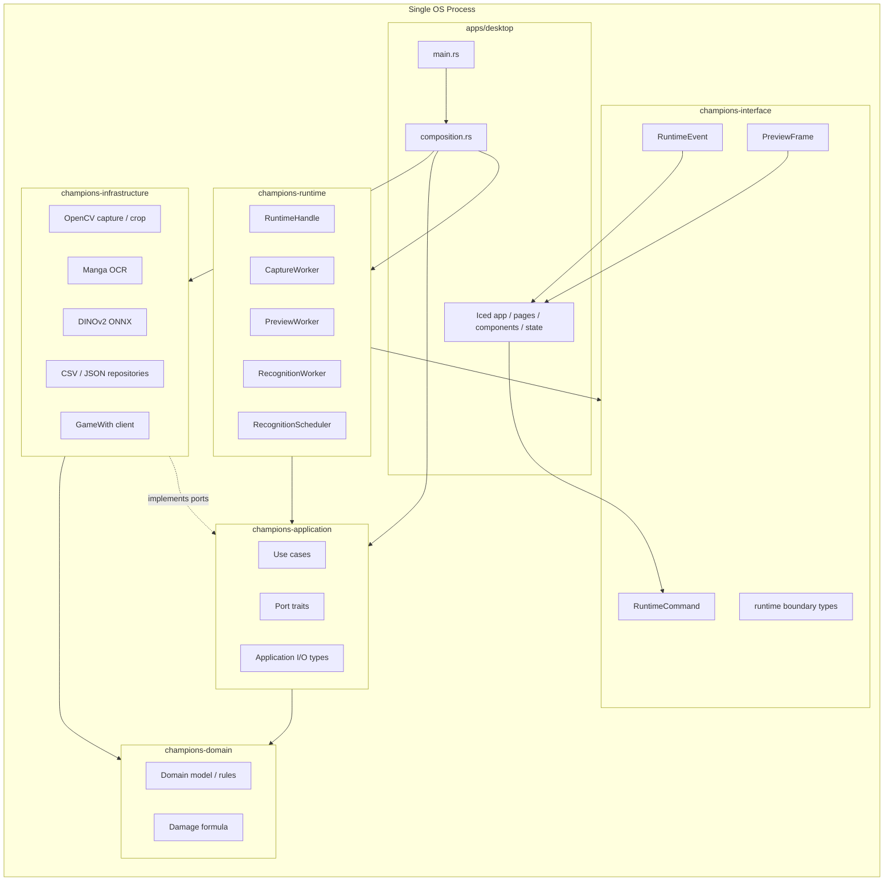

# champions-agent リアーキテクチャ設計書 v3

## 目的

この設計書群は、現行の `champions-agent` を、Rust 2024 edition の workspace 構成へ段階的に移行するための実装指示書である。対象は、ローカルデスクトップアプリとして動くポケモン Champions 支援ツールである。

最終形は **単一 OS プロセス、複数専用スレッド、Iced 統合 UI、latest-only frame 処理、DDD / Onion Architecture に沿った crate 分割** とする。

この v3 では、レビュー後の採用方針を反映し、次を確定した。

| 項目 | v3 の確定方針 |
|---|---|
| UI import 境界 | `apps/desktop` は 1 crate のまま。`main.rs` と `composition.rs` 以外から `champions_infrastructure` を import することを CI で禁止する |
| Application と Interface | `champions-application` は `champions-interface` に依存しない |
| Runtime と Infrastructure | `champions-runtime` は `champions-infrastructure` に依存しない。composition root で adapter を注入する |
| OpenCV Mat | `opencv::core::Mat` は infrastructure 内部に閉じる。runtime、application、interface、UI へ出さない |
| Preview | preview stream と runtime event stream を分離する。preview は drop 可、recognition / error / shutdown は drop 不可 |
| Use Case | application の use case 入出力は application 型にする。UI-facing view model を返さない |
| Port | OCR、ONNX、repository port は原則として同期 trait にする |
| Data path | bundled resource、user data、cache、debug output を分離する |
| Save | `party.json` と `usage.json` は atomic write にする |
| Recognition | confidence、unknown、top candidates、duplicate conflict を型で表す |
| Capture backend | Windows / Linux backend を `CaptureConfig` で選択可能にする |

## 設計書の MECE 分割

この設計書群では、同じ情報を複数文書に重複して定義しない。各文書は以下の責務だけを持つ。

| ファイル | 扱う範囲 | 扱わない範囲 |
|---|---|---|
| `00_index.md` | 設計書群の目的、読み方、v3 の確定方針 | 個別実装手順 |
| `01_current_state.md` | 現行システムの事実、問題、維持資産 | 目標構造の詳細 |
| `02_decisions_and_principles.md` | 採用判断、非採用判断、設計原則、禁止事項 | ファイル配置、API 詳細 |
| `03_target_architecture.md` | 目標アーキテクチャの全体像、実行時フロー | 個別 crate の公開 API |
| `04_workspace_directory_structure.md` | workspace、crate、module、resource の配置 | crate 間の依存契約 |
| `05_crate_contracts.md` | crate 責務、依存規則、公開 API、禁止 import | worker の時系列処理 |
| `06_runtime_and_iced_preview.md` | capture、preview、recognition worker、scheduler、shutdown | use case 内部の business rule |
| `07_use_cases_and_ports.md` | application use case、port trait、application input/output | UI component の描画 |
| `08_data_boundaries.md` | 型の所属、変換、ID、error、path、保存形式 | 移行順序 |
| `09_migration_plan.md` | 現行ファイルから新構造への段階移行 | 性能目標の詳細 |
| `10_testing_performance_operations.md` | テスト、性能、CI、ログ、運用、debug 方針 | 移行作業の順番 |
| `11_agent_checklist.md` | AI エージェント向け作業チェックリスト | 設計理由の詳説 |

## 推奨読順

1. `01_current_state.md` で現行の混在責務を確認する。
2. `02_decisions_and_principles.md` で、採用済み判断と禁止事項を確認する。
3. `03_target_architecture.md` で、最終形の概念構造と実行時フローを把握する。
4. `04_workspace_directory_structure.md` と `05_crate_contracts.md` に従って workspace と crate skeleton を作る。
5. `07_use_cases_and_ports.md` と `08_data_boundaries.md` に従って application / domain / infrastructure の型を移す。
6. `06_runtime_and_iced_preview.md` に従って HighGUI を Iced preview に置換する。
7. `09_migration_plan.md` に従って段階的に移行する。
8. `10_testing_performance_operations.md` と `11_agent_checklist.md` で完了条件を検査する。

## 最終アーキテクチャ要約

## 絶対ルール

| ID | ルール | 検査方法 |
|---|---|---|
| R-01 | `champions-domain` は UI、OpenCV、ONNX、OCR、HTTP、file I/O を知らない | `Cargo.toml` と import 検査 |
| R-02 | `champions-application` は `champions-interface` に依存しない | crate dependency 検査 |
| R-03 | `champions-runtime` は `champions-infrastructure` に依存しない | crate dependency 検査 |
| R-04 | `opencv::core::Mat` は infrastructure の OpenCV adapter 内部だけで使う | grep 検査 |
| R-05 | Iced UI thread で OCR、ONNX、OpenCV capture、CSV 大量ロードを実行しない | code review / test |
| R-06 | preview と full frame を unbounded queue に積まない | runtime helper のみ使用 |
| R-07 | HighGUI は最終成果物に残さない | feature / grep 検査 |
| R-08 | user-writable data を `resources/` に置かない | path 検査 |
| R-09 | `party.json` と `usage.json` は atomic write する | repository test |
| R-10 | `apps/desktop/src/pages`, `components`, `state`, `app.rs` から infrastructure を import しない | CI grep |

## 用語

| 用語 | 意味 |
|---|---|
| bundled resource | アプリに同梱され、通常は読み取り専用の master data、model、画像 |
| user data | ユーザー編集により更新される保存データ。例: `party.json` |
| cache | 外部サイトから refresh 可能なデータ。例: `usage.json` |
| runtime event | 認識結果、状態変更、error、shutdown など捨ててはいけない通知 |
| preview frame | UI 表示用の RGBA8 画像。古いものは捨ててよい |
| latest-only | 古い frame を蓄積せず、常に最新 frame だけを参照する方針 |
| composition root | adapter、repository、use case、runtime、UI を組み立てる場所 |
