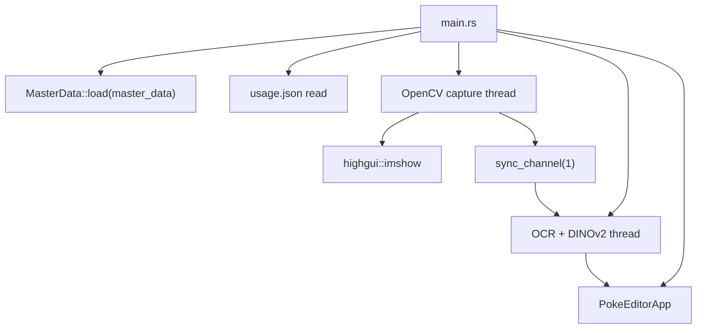
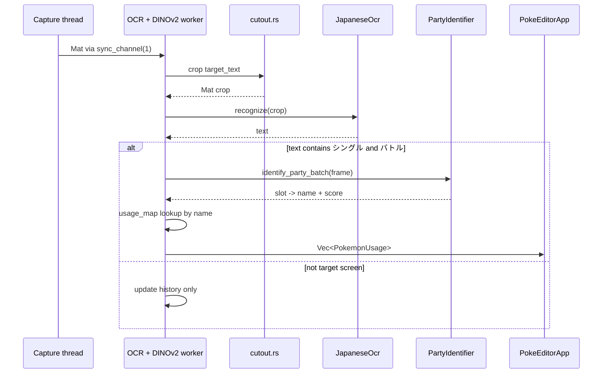

# 01. 現行システムの整理

## この文書の範囲

この文書は、現行 `champions-agent` の事実、問題、移行時に維持すべき資産を整理する。目標アーキテクチャや移行手順は扱わない。

## 現行構造

現行は単一 Cargo package の中に、UI、画像認識、OCR、ダメージ計算、GameWith fetcher、マスターデータ読み込み、OpenCV capture が同居している。

```text
champions-agent/
├── Cargo.toml
├── assets/
│   └── fonts/
├── scripts/
│   ├── download_pokemon_images.py
│   └── export_dino.py
└── src/
    ├── main.rs
    ├── lib.rs
    ├── application.rs
    ├── application/
    ├── damage.rs
    ├── damage/
    ├── domain.rs
    ├── domain/
    ├── infrastructure.rs
    ├── infrastructure/
    ├── party.rs
    ├── party/
    ├── ui.rs
    └── ui/
```

現行 `Cargo.toml` は、同一 package に binary `champions-agent` と library `usage_fetcher` を置いている。依存には `iced`、`opencv`、`ort`、`manga-ocr-rs`、`reqwest`、`csv`、`tokio`、`image` が含まれ、UI と重い外部技術が同一 package に集約されている。

## 現行ファイル責務

| 現行ファイル | 主な責務 | 問題 |
|---|---|---|
| `src/main.rs` | 起動、path 定数、MasterData load、usage JSON load、OpenCV capture、HighGUI preview、OCR worker、DINOv2 worker、Iced 起動 | composition root と処理本体が混在している |
| `src/lib.rs` | GameWith fetcher、usage 型、module 公開 | library 名が `usage_fetcher` である一方、アプリ全体 module を公開している |
| `src/ui/app.rs` | Iced app、tab、選出サポート表示、usage DTO、mpsc subscription、party.json load/save | UI が永続化、DTO、受信 loop を直接持っている |
| `src/ui/pokemon.rs` | 1 匹分フォーム、入力検証、サジェスト、SavedPokemon 変換 | UI state が `MasterData` を直接持っている |
| `src/domain/master_data.rs` | サジェスト用 master data load | domain が CSV / JSON / file path を直接扱っている |
| `src/domain/party.rs` | SavedParty / SavedPokemon、`PartyRepository` trait | repository 名が画像識別に使われている |
| `src/damage/calc.rs` | ダメージ計算本体 | 純粋計算に近く、domain へ移しやすい |
| `src/damage/loader.rs` | CSV master data load | infrastructure repository に置くべき |
| `src/party/cutout.rs` | OpenCV Mat crop、RGB bytes 変換 | vision infrastructure に置くべき |
| `src/party/ocr.rs` | Manga OCR adapter | OCR adapter として infrastructure に置くべき |
| `src/party/identifier.rs` | DINOv2 ONNX、embedding cache、party identification | heavy vision adapter として infrastructure に置くべき |
| `src/application/party_service.rs` | `PartyIdentifierService` を呼ぶ orchestrator | 現行 main pipeline と接続されていない |
| `src/infrastructure/party_identifier_impl.rs` | `OnnxPartyIdentifier` 仮実装 | 本実装 `src/party/identifier.rs` と乖離している |

## 現行実行フロー



## 現行認識フロー



## 現行の良い設計資産

| 資産 | 維持理由 | v3 移行先 |
|---|---|---|
| `sync_channel(1)` 相当の思想 | 古い frame を溜めないため latency が増えにくい | `champions-runtime` の latest-only slot |
| 選出画面連続時の DINOv2 skip | ONNX 推論負荷を抑える | `RecognitionScheduler` |
| `src/damage/calc.rs` | 純粋計算に近く、回帰テスト対象にしやすい | `champions-domain/src/battle` |
| `src/damage` の rstest | 移行時の安全網になる | domain test / integration test |
| `src/party/cutout.rs` の crop 比率 | 認識精度に関わる既存知見 | `champions-infrastructure/src/vision/cropper.rs` |
| `src/party/identifier.rs` の embedding cache | 初期認識性能に必要 | `OnnxPartyIdentifier` |
| `src/party/ocr.rs` の Manga OCR adapter | 選出画面判定に必要 | `MangaOcrEngine` |
| GameWith parser | usage refresh 機能に必要 | `GameWithUsageClient` |

## 現行の主要問題

| 問題 | 影響 | v3 の解決先 |
|---|---|---|
| `main.rs` が肥大化している | 起動、認識、capture、UI が切り分けられない | `apps/desktop/src/main.rs` と `composition.rs` は wiring に限定する |
| HighGUI と Iced が二重 UI | shutdown と UX が分断される | HighGUI を廃止し Iced preview に統合する |
| worker から `process::exit(0)` | graceful shutdown できない | `RuntimeCommand::Shutdown` と `RuntimeStopped` に統一する |
| UI が `std::fs::write` で保存 | UI と永続化が結合する | `SavePartyUseCase` + `JsonPartyRepository` に移す |
| UI が `MasterData` を持つ | サジェストが UI に閉じる | `SuggestNamesUseCase` に移す |
| domain が CSV / JSON を読む | domain purity に反する | `CsvCatalogRepository` と `JsonUsageRepository` に移す |
| usage DTO が UI にある | domain / interface / UI state の境界が曖昧 | domain usage model と UI表示型を分ける |
| OpenCV `Mat` が thread 間で直接流れる | ownership / clone policy が不明確 | infrastructure で owned buffer に変換する |
| `CAP_V4L2` 固定 | Windows で不安定 | `CaptureConfig.backend` で選択する |
| `capture.png` を常時保存 | I/O 負荷が高い | debug command 時だけ保存する |
| path 定数が `main.rs` に散在 | 配布時 resource / user data を分けにくい | `AppPaths` に集約する |
| 仮実装と本実装が乖離 | AI agent が誤った実装を移植しやすい | 本実装は `src/party/identifier.rs` を基準にする |

## 移行時の注意

現行の `src/application/party_service.rs` と `src/infrastructure/party_identifier_impl.rs` は、設計意図の断片としては参考になるが、実際の認識 pipeline の本体ではない。認識移植の主対象は `src/party/cutout.rs`、`src/party/ocr.rs`、`src/party/identifier.rs`、`src/main.rs` の worker loop である。

現行の `domain::party::PartyRepository` は repository という名前だが、`find_best_match(image_data)` を持つため repository ではなく identifier に相当する。v3 では削除または改名する。
