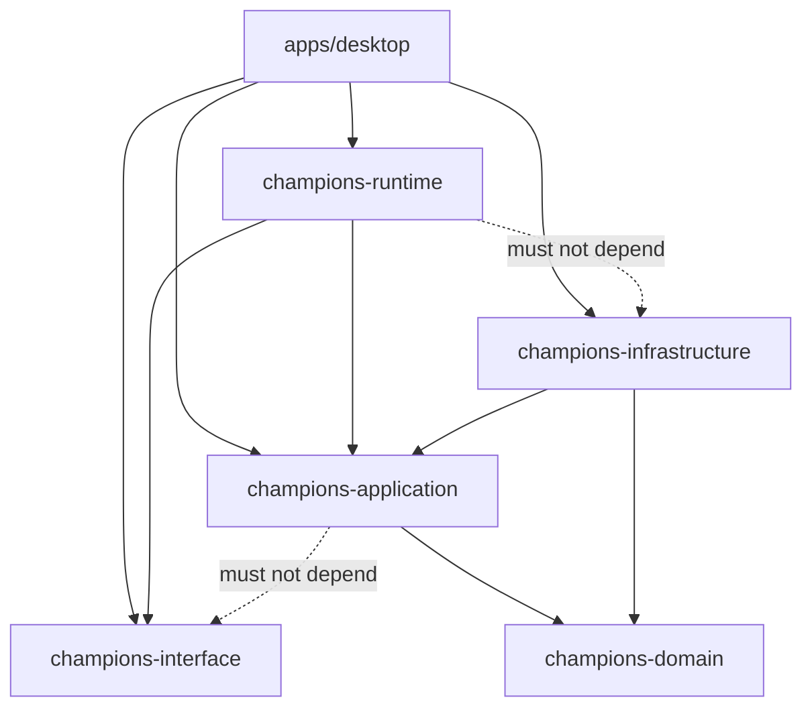

# 02. 設計判断と原則

## この文書の範囲

この文書は、v3 で採用する判断、採用しない判断、依存原則、命名原則、禁止事項を定義する。ディレクトリ構造、crate API、runtime 詳細は別文書で扱う。

## Architecture Decision Records

| ID | 判断 | 採用内容 | 理由 | 代替案 |
|---|---|---|---|---|
| D-01 | 実行形態 | 単一 OS プロセス | ローカルデスクトップツールで HTTP / WS の起動順序、port、shutdown 管理を避ける | UI / backend 別プロセス |
| D-02 | 並行処理 | 複数専用スレッド + bounded channel / latest slot | UI thread を守りつつ capture、preview、recognition を並行できる | 1 スレッド、unbounded queue |
| D-03 | UI | Iced に統合 | パーティ編集、選出サポート、プレビュー、status を 1 window で管理する | HighGUI 維持 |
| D-04 | Preview | RGBA8 の preview frame を同一プロセス内で渡す | JPEG encode / decode と WebSocket overhead を避ける | JPEG DTO、H.264、WebSocket |
| D-05 | Frame 処理 | latest-only | 古い frame を処理しても価値が薄く、latency の原因になる | frame queue 蓄積 |
| D-06 | 推論頻度 | OCR / ONNX を毎 frame 実行しない | CPU / GPU / memory bandwidth を保護する | 全 frame 推論 |
| D-07 | crate 構成 | workspace + library crates | domain、application、runtime、infrastructure、UI を compile-time に分ける | 単一 crate 継続 |
| D-08 | API contract | 初期実装では HTTP API contract を作らない | プロセス分離しないため request/response DTO は不要 | `champions-api-contract` crate |
| D-09 | Interface crate | `champions-interface` を残す。ただし runtime boundary 型に限定する | UI と runtime の command / event / preview 型を共有する | runtime に event 型を吸収 |
| D-10 | Application boundary | `champions-application` は `champions-interface` に依存しない | use case を UI 表示都合から切り離す | use case が view model を返す |
| D-11 | Runtime boundary | `champions-runtime` は `champions-infrastructure` に依存しない | runtime 単体テストを軽くし、OpenCV / ONNX 依存を切る | runtime が具象 adapter を直接呼ぶ |
| D-12 | OpenCV Mat | `Mat` は infrastructure 内部だけで使う | thread ownership と clone policy を明確にする | runtime latest slot に `Mat` を持つ |
| D-13 | Port style | OCR、ONNX、repository port は同期 trait | 本質的に blocking 処理であり、async trait の lifetime 問題を避ける | 全 port async |
| D-14 | Event stream | preview stream と runtime event stream を分ける | preview が channel を埋めて重要 event を遅延させるのを防ぐ | `RuntimeEvent::PreviewFrame` に同居 |
| D-15 | Resource path | resources / user_data / cache / debug を分離する | 配布後の書き込み権限とデータ性質を明確にする | `resources/master_data` に全部置く |
| D-16 | UI import guard | `apps/desktop` は 1 crate + CI grep で guard | crate 増加を避けつつ UI から infra 直 import を防ぐ | `desktop-ui` crate 分離 |
| D-17 | Rust module | `mod.rs` を使わない | Rust 2024 の見通しを優先する | `foo/mod.rs` 形式 |

## 採用しないもの

| 非採用 | 理由 | 将来採用条件 |
|---|---|---|
| ローカル HTTP API server | port 競合、起動順、CORS、shutdown、ゾンビ process 対策が増える | Web UI や外部 client を提供する場合 |
| WebSocket preview | 同一 process では過剰 | 別 process preview が必要になった場合 |
| JPEG preview 既定 | 同一 process では RGBA8 の方が単純 | network / IPC 転送が必要になった場合 |
| HighGUI preview | Iced UI と lifecycle が分断される | 性能比較用の一時 feature `debug-highgui` のみ |
| domain 内 file I/O | domain purity に反する | なし |
| UI 内 repository 実装 | UI と永続化が結合する | なし |
| unbounded frame queue | latency と memory が増える | なし |
| application の UI-facing output | use case 再利用性が下がる | なし |

## 依存方向の原則

依存は内側へ向ける。ただし runtime は実行制御層として application を呼ぶ外側の層である。

## DDD / Onion の適用粒度

このアプリはローカル desktop tool である。Web API system と同じ厳格さで全境界に DTO を挟まない。ただし、外部技術依存と UI 依存は明確に分ける。

| 境界 | 分離の強さ | 方針 |
|---|---|---|
| domain と infrastructure | 強い | file、OpenCV、OCR、ONNX、HTTP を domain に入れない |
| application と infrastructure | 強い | application は port trait に依存し、実装は infrastructure に置く |
| application と interface | 強い | application は interface 型を知らない |
| runtime と infrastructure | 強い | runtime trait / adapter は composition root で接続する |
| runtime と UI | 中 | command / event / preview stream で分ける |
| UI と application | 中 | UI は use case を呼ぶが、input/output は application 型へ変換する |

## 性能原則

| 原則 | 内容 |
|---|---|
| UI thread は軽くする | Iced `update` / `view` で OCR、ONNX、capture、CSV 大量ロードをしない |
| 最新 frame だけを見る | full frame と preview frame は latest-only にする |
| preview は低負荷にする | 初期値は max width 960px、10-15fps |
| 推論は状態遷移で走らせる | 選出画面に入ったときだけ DINOv2 を実行する |
| disk I/O を常用 loop から外す | `capture.png` の毎 frame 保存は禁止 |
| 計測で調整する | CPU、memory、UI latency、recognition latency、drop count を見る |

## 名前付け原則

| 名前 | 正しい用途 | 禁止例 |
|---|---|---|
| `Repository` | 保存済みデータ、master data、cache data の取得 / 保存 | 画像識別器に使う |
| `Identifier` | 画像や特徴量から対象を推定する処理 | JSON / CSV 読み込みに使う |
| `Fetcher` / `Client` | 外部サイトや API から取得する処理 | local JSON repository に使う |
| `Engine` | OCR など処理エンジンの adapter | domain service に使う |
| `UseCase` | UI または runtime から見た操作 | UI component に使う |
| `Worker` | runtime 内で動く長寿命 thread / task | domain service に使う |
| `State` | UI state または scheduler state | 永続化 model に使う |
| `Frame` | capture / preview の 1 枚 | 動画全体に使う |
| `View` | UI 表示用、または runtime event payload 用 | application result の正式名に使う |

## 成功条件

| 条件 | 判定 |
|---|---|
| `main.rs` が起動と wiring に限定される | OCR / ONNX / crop / save の実装がない |
| Iced preview が動く | HighGUI window が通常起動で出ない |
| UI が `MasterData` を持たない | `apps/desktop` UI state に master data repository がない |
| UI が `party.json` を直接読まない | load/save は use case 経由 |
| domain が外部技術に依存しない | domain Cargo.toml に `iced`, `opencv`, `ort`, `manga-ocr-rs`, `reqwest`, `csv` がない |
| runtime が infrastructure に依存しない | runtime Cargo.toml に `champions-infrastructure` がない |
| frame queue が unbounded でない | capture / preview / recognition すべて bounded または latest-only |
| recognition result が構造化される | confidence、unknown、candidates、duplicate conflict が表現される |
| data path が分離される | `party.json` は user data、`usage.json` は cache |
| damage regression test が通る | 既存 rstest 相当の test が移行後も通る |
