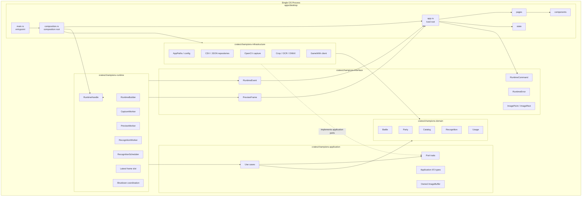
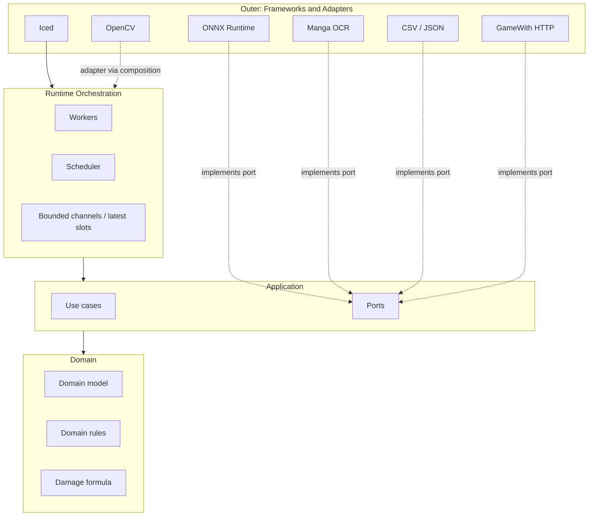
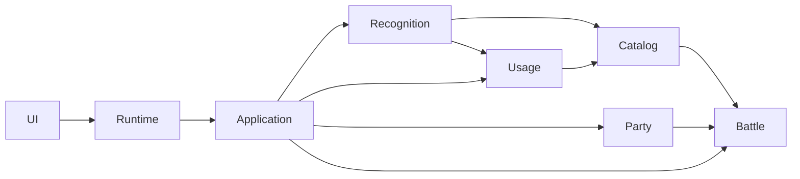
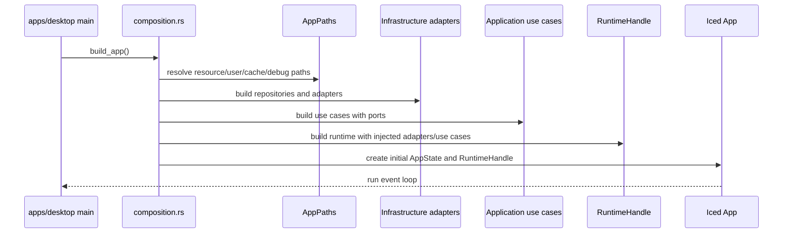
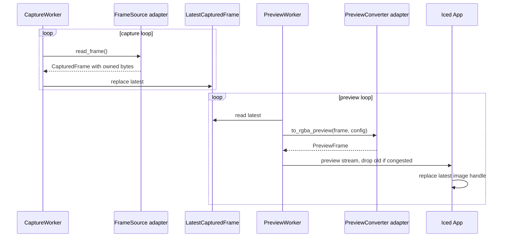
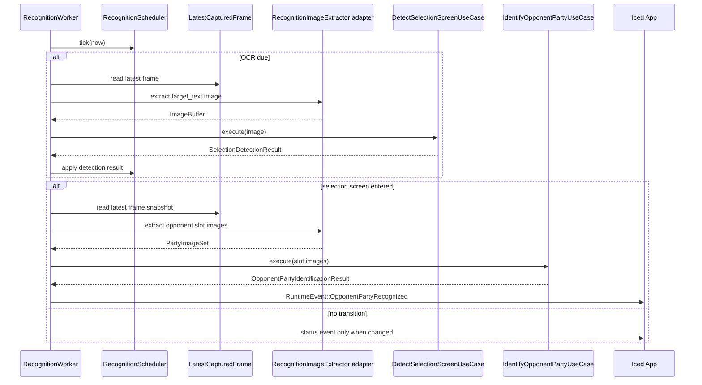

# 03. 目標アーキテクチャ

## この文書の範囲

この文書は、リアーキテクチャ後の全体像、層構造、実行時フロー、source of truth を定義する。ディレクトリ構造は `04_workspace_directory_structure.md`、crate 契約は `05_crate_contracts.md`、runtime 詳細は `06_runtime_and_iced_preview.md` で扱う。

## 全体像

最終形は、単一 OS process 内に Iced UI と local runtime を持つ。論理的には UI、runtime、application、domain、infrastructure を分けるが、HTTP / WebSocket による process 分離はしない。

## Layer 定義

| Layer | 配置 | 役割 | 代表的な禁止事項 |
|---|---|---|---|
| Presentation | `apps/desktop` | Iced UI、画面状態、ユーザー操作、preview 表示 | OCR / ONNX / OpenCV capture 実装、repository 実装 |
| Interface | `champions-interface` | UI と runtime の境界型 | Iced widget、OpenCV Mat、file I/O |
| Runtime | `champions-runtime` | worker orchestration、latest-only、scheduler、shutdown | OpenCV / ONNX / OCR の具象実装 |
| Application | `champions-application` | use case、port trait、application input/output | interface 型、Iced、OpenCV、file path 直読み |
| Domain | `champions-domain` | ルール、entity、value object、純粋計算 | infrastructure、Iced、CSV、JSON、HTTP |
| Infrastructure | `champions-infrastructure` | OpenCV、Manga OCR、ONNX、CSV、JSON、GameWith、path | Iced UI |

## Onion 構造

Runtime layer は古典的な Onion の中心ではない。このプロジェクトでは camera、preview、OCR、ONNX という長寿命処理を UI と use case から分離するために必要な orchestration layer である。

## Bounded Context

| Context | 役割 | 主な配置 |
|---|---|---|
| Battle | ダメージ計算、ステータス、ランク補正、タイプ相性 | `champions-domain/src/battle` |
| Party | 自分の party、保存対象、ポケモン構成 | `champions-domain/src/party` |
| Catalog | species、move、item、nature、ability、type、master data | `champions-domain/src/catalog` |
| Recognition | screen state、recognized party、confidence、candidate、slot | `champions-domain/src/recognition` |
| Usage | 使用率、技、持ち物、努力値、性格の利用率 | `champions-domain/src/usage` |
| Runtime | capture / preview / recognition の実行制御 | `champions-runtime` |
| UI | 画面状態、入力途中 state、表示 component | `apps/desktop` |

## Context 関係

この図は概念関係であり、Rust crate 依存図ではない。crate 依存図は `05_crate_contracts.md` を正とする。

## 起動フロー

## Preview フロー

## Recognition フロー

## Source of Truth

| 状態 | Source of Truth | UI での扱い |
|---|---|---|
| runtime 起動状態 | `champions-runtime` | `RuntimeEvent` で `AppState` に反映 |
| capture 最新 frame | `LatestCapturedFrame` | UI は直接保持しない |
| preview 最新画像 | preview stream | `PreviewState` が最新 image handle だけ保持 |
| recognition 状態 | `RecognitionScheduler` | `SelectionSupportState` に反映 |
| 自分の party | `PartyRepository` | `PartyEditorState` は編集中 copy を持つ |
| master data | `CatalogRepository` | UI は suggestion 結果だけ持つ |
| usage data | `UsageRepository` | UI は recognition result または usage query result を表示する |
| resource path | `AppPaths` | UI は直接 path を構築しない |

## 変更しない前提

| 項目 | 方針 |
|---|---|
| アプリ種別 | desktop app のまま |
| メイン UI | Iced を継続 |
| 言語 | Rust 2024 edition |
| OCR | 初期実装では Manga OCR を継続 |
| アイコン識別 | 初期実装では DINOv2 ONNX を継続 |
| マスターデータ | CSV / JSON / image assets を継続利用 |
| 実行形態 | 初期実装では process 分離しない |
