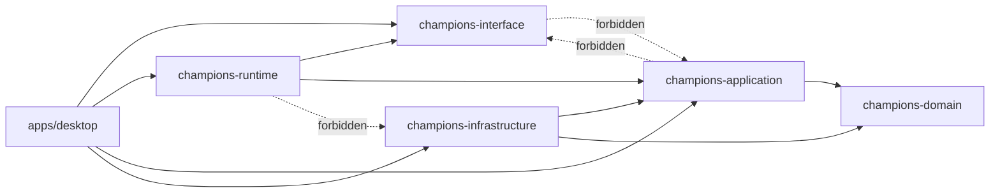

# 05. Crate 契約と依存ルール

## この文書の範囲

この文書は、各 crate の責務、許可依存、公開 API、禁止事項、CI import guard を定義する。ファイル配置は `04_workspace_directory_structure.md`、worker 処理は `06_runtime_and_iced_preview.md` を正とする。

## Crate 依存図



`apps/desktop` が `champions-infrastructure` に依存するのは composition root で adapter を生成するためだけである。

## Crate 一覧

| crate | 種別 | 役割 | 直接依存してよいもの | 依存してはいけないもの |
|---|---|---|---|---|
| `champions-domain` | library | domain model、ルール、純粋計算 | `thiserror` など軽量 crate | `iced`, `opencv`, `ort`, `manga-ocr-rs`, `reqwest`, `csv`, file I/O |
| `champions-application` | library | use case、port trait、application I/O | `champions-domain`, `thiserror` | `champions-interface`, `iced`, `opencv`, `ort`, `manga-ocr-rs`, `reqwest` 直接利用 |
| `champions-infrastructure` | library | port 実装、OpenCV、OCR、ONNX、CSV、JSON、外部取得 | `champions-domain`, `champions-application`, 外部技術 crate | `iced`, UI state |
| `champions-runtime` | library | worker orchestration、latest-only、scheduler、shutdown | `champions-interface`, `champions-application`, `tokio`, `tracing` | `champions-infrastructure`, `iced` widget, `opencv` |
| `champions-interface` | library | runtime boundary 型 | `serde` optional、軽量型 | `champions-application`, `champions-domain` 原則不可、`iced`, `opencv`, file I/O |
| `apps/desktop` | binary | Iced app、composition root | `iced`, 各 crate | OCR / ONNX / crop 実装の直書き |

## `champions-domain`

### 公開 API

```rust
pub mod battle;
pub mod catalog;
pub mod party;
pub mod recognition;
pub mod usage;

pub use battle::{DamageCalculator, DamageInput, DamageRoll};
pub use catalog::{BattleMasterData, PokemonSpecies, SpeciesId};
pub use party::{PokemonBuild, SavedParty};
pub use recognition::{RecognizedParty, ScreenState};
pub use usage::PokemonUsageSummary;
```

### 含めるもの

| Context | 含める型 / 処理 |
|---|---|
| Battle | `DamageInput`, `DamageRoll`, `Stat`, `StatStage`, `DamageCalculator` |
| Catalog | `SpeciesId`, `PokemonSpecies`, `MoveData`, `Item`, `Nature`, `Ability`, `BattleMasterData` |
| Party | `SavedParty`, `PokemonBuild`, `MoveSet`, `EffortValueSpread` |
| Recognition | `ScreenState`, `SelectionSlot`, `RecognizedPokemon`, `RecognizedParty`, `ConfidenceScore`, `RecognitionCandidate` |
| Usage | `PokemonUsageSummary`, `MoveUsage`, `ItemUsage`, `EffortValueUsage`, `NatureUsage` |

### 禁止事項

```text
std::fs
csv::Reader
serde_json::Value
opencv::core::Mat
iced::*
ort::*
manga_ocr_rs::*
reqwest::*
```

## `champions-application`

### 公開 API

```rust
pub mod errors;
pub mod image;
pub mod io;
pub mod ports;
pub mod use_cases;

pub use use_cases::{
    CalculateDamageUseCase,
    DetectSelectionScreenUseCase,
    GetPokemonUsageUseCase,
    IdentifyOpponentPartyUseCase,
    LoadPartyUseCase,
    RefreshUsageDataUseCase,
    SavePartyUseCase,
    SuggestNamesUseCase,
};
```

### 責務

| 責務 | 内容 |
|---|---|
| Use case | UI または runtime から見た操作を表す |
| Port trait | repository、OCR、identifier、fetcher の抽象 |
| Application I/O | use case input / output 型を定義する |
| Image boundary | OCR / ONNX port に渡す owned image buffer を定義する |
| Error conversion | application error を構造化する |

### 禁止事項

`champions-interface` に依存しない。`PartyView` や `PokemonUsageView` のような UI-facing 型を use case の正式 output にしない。

## `champions-infrastructure`

### 公開 API

```rust
pub mod capture;
pub mod config;
pub mod external;
pub mod persistence;
pub mod vision;

pub use capture::{CaptureBackend, CaptureConfig, OpenCvCapture};
pub use config::AppPaths;
pub use external::GameWithUsageClient;
pub use persistence::{CsvCatalogRepository, JsonPartyRepository, JsonUsageRepository};
pub use vision::{MangaOcrEngine, OnnxPartyIdentifier, OpenCvCropper, OpenCvFrameConverter};
```

### 責務

| module | 責務 |
|---|---|
| `config` | `AppPaths`、resource / user data / cache / debug path の解決 |
| `capture` | OpenCV `VideoCapture` の初期化と frame read。`Mat` はここで owned buffer に変換する |
| `vision/cropper.rs` | crop 比率、ROI、BGR/RGB/RGBA 変換、debug crop save |
| `vision/manga_ocr_engine.rs` | `OcrEngine` port 実装 |
| `vision/onnx_party_identifier.rs` | `PartyIdentifier` port 実装、DINOv2 session、embedding cache |
| `persistence/csv_catalog_repository.rs` | CSV master data 読み込み、name suggestion、species resolve |
| `persistence/json_party_repository.rs` | `party.json` load / atomic save |
| `persistence/json_usage_repository.rs` | `usage.json` load / atomic replace |
| `external/gamewith_usage_client.rs` | GameWith HTML 取得と parse |

### 禁止事項

`champions-infrastructure` は Iced UI を知らない。`iced::Element`、`iced::widget::*`、`AppState`、`PokemonFormState` を import してはならない。

## `champions-runtime`

### 公開 API

```rust
pub mod builder;
pub mod handle;
pub mod traits;
pub mod shutdown;

pub use builder::RuntimeBuilder;
pub use handle::RuntimeHandle;
pub use shutdown::RuntimeShutdown;
pub use traits::{FrameSource, PreviewFrameConverter, RecognitionImageExtractor};
```

### Runtime adapter trait

`champions-runtime` は traits を定義するが、`champions-infrastructure` は直接これに依存しない。`apps/desktop/src/composition.rs` が adapter wrapper を実装して接続する。

```rust
pub trait FrameSource: Send {
    fn read_frame(&mut self) -> Result<Option<CapturedFrame>, CaptureRuntimeError>;
}

pub trait PreviewFrameConverter: Send + Sync {
    fn convert(&self, frame: &CapturedFrame, config: PreviewConfig) -> Result<PreviewFrame, PreviewRuntimeError>;
}

pub trait RecognitionImageExtractor: Send + Sync {
    fn extract_target_text(&self, frame: &CapturedFrame) -> Result<ImageBuffer, RecognitionRuntimeError>;
    fn extract_opponent_slots(&self, frame: &CapturedFrame) -> Result<PartyImageSet, RecognitionRuntimeError>;
}
```

### 禁止事項

`champions-runtime` の `Cargo.toml` に `champions-infrastructure`、`opencv`、`ort`、`manga-ocr-rs`、`iced` を入れない。

## `champions-interface`

### 公開 API

```rust
pub mod command;
pub mod error;
pub mod event;
pub mod ids;
pub mod image_geometry;
pub mod preview;
pub mod recognition_view;

pub use command::RuntimeCommand;
pub use event::RuntimeEvent;
pub use preview::PreviewFrame;
```

### 含める型

| module | 型 |
|---|---|
| `ids.rs` | `FrameSequence`, `EventSequence`, `RecognitionAttemptId` |
| `command.rs` | `RuntimeCommand`, `RecognitionControlCommand` |
| `event.rs` | `RuntimeEvent`, `CaptureStatus`, `RecognitionStatus` |
| `error.rs` | `RuntimeError`, `RuntimeErrorKind`, `RuntimeErrorSeverity`, `Recoverability` |
| `preview.rs` | `PreviewFrame`, `PreviewStats` |
| `image_geometry.rs` | `ImagePoint`, `ImageRect`, `RgbaColor` |
| `recognition_view.rs` | `OpponentPartyView`, `RecognizedPokemonView`, `UsageSummaryView` |

### 含めない型

```text
PartyInput
PartyEditorState
PokemonFormState
DamageRequestView
DamageResultView
SuggestionList UI state
repository trait
use case result 型
Iced image handle
```

## `apps/desktop`

### composition root

`main.rs` は entrypoint に限定する。実際の組み立ては `composition.rs` に寄せる。

```rust
fn main() -> iced::Result {
    champions_agent_desktop::composition::run()
}
```

`composition.rs` だけが repository、OpenCV adapter、OCR adapter、ONNX adapter、use case、runtime を生成して接続する。

### UI module の禁止 import

以下では `champions_infrastructure` を import しない。

```text
apps/desktop/src/app.rs
apps/desktop/src/message.rs
apps/desktop/src/mapping.rs
apps/desktop/src/subscriptions.rs
apps/desktop/src/state/*
apps/desktop/src/pages/*
apps/desktop/src/components/*
```

許可される import は主に次である。

```text
iced
champions_interface
champions_runtime::RuntimeHandle
champions_application::io
```

## UI import guard の CI 例

A 方針として crate は分けず、grep で guard する。

```bash
#!/usr/bin/env bash
set -euo pipefail

if grep -R "champions_infrastructure" \
  apps/desktop/src/app.rs \
  apps/desktop/src/message.rs \
  apps/desktop/src/mapping.rs \
  apps/desktop/src/subscriptions.rs \
  apps/desktop/src/state \
  apps/desktop/src/pages \
  apps/desktop/src/components; then
  echo "UI modules must not import champions_infrastructure" >&2
  exit 1
fi
```

`apps/desktop/src/main.rs` と `apps/desktop/src/composition.rs` は whitelist とする。

## Cargo feature 方針

| feature | crate | 用途 | 既定 |
|---|---|---|---|
| `cuda` | `champions-infrastructure` | ONNX Runtime CUDA provider | off または platform に応じて選択 |
| `debug-highgui` | `champions-infrastructure` | 移行中の性能比較 | off |
| `serde` | `champions-interface` | 将来 IPC / API 化の serialize | off |
| `image-widget` | `apps/desktop` | Iced image widget | on |

## Repository と Identifier の区別

| 名前 | 正しい意味 | 例 |
|---|---|---|
| Repository | 保存済みデータ、master data、usage data の取得 / 保存 | `PartyRepository`, `CatalogRepository` |
| Identifier | 画像や特徴量から対象を識別する | `PartyIdentifier` |
| Fetcher / Client | 外部サイトや API から取得する | `UsageFetcher`, `GameWithUsageClient` |
| Engine | OCR など処理エンジン | `OcrEngine`, `MangaOcrEngine` |
