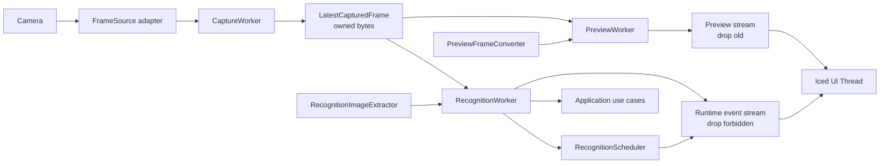
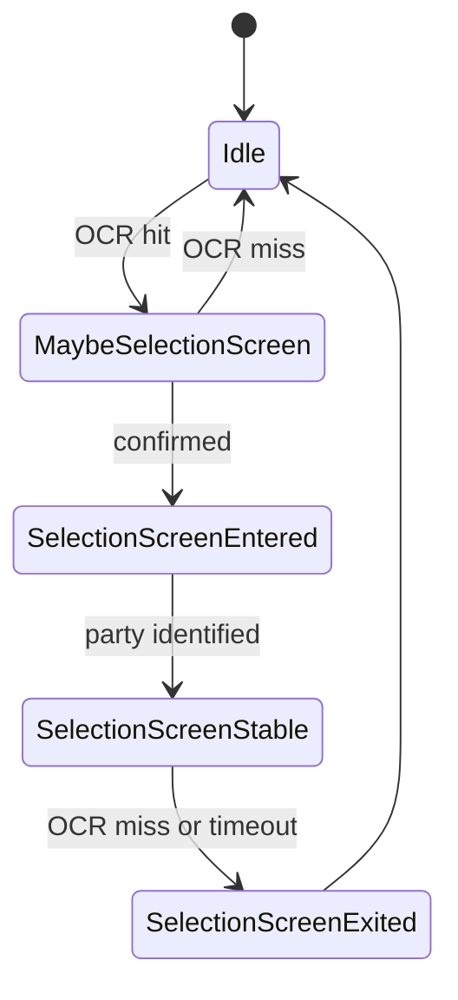
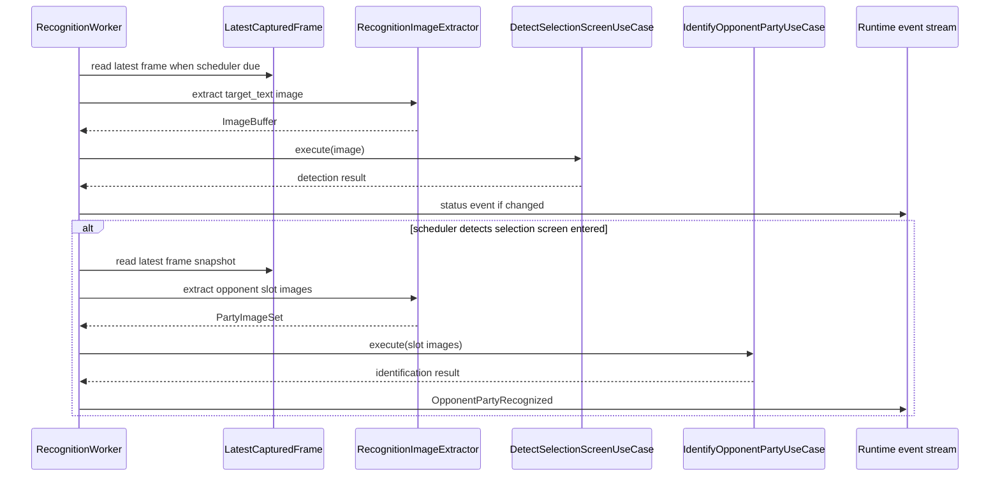
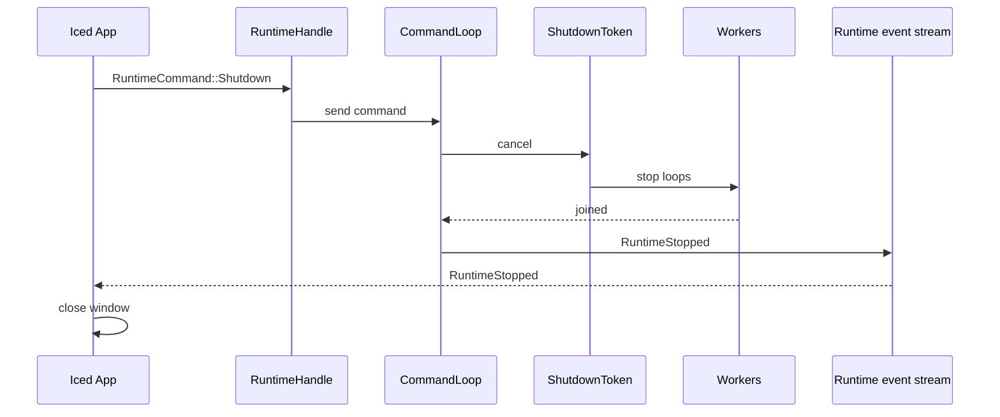

# 06. Runtime と Iced プレビュー設計

## この文書の範囲

この文書は、映像 capture、Iced preview、OCR / ONNX recognition、scheduler、shutdown、runtime stream を定義する。use case と port trait の詳細は `07_use_cases_and_ports.md`、型の所属は `08_data_boundaries.md` を正とする。

## 基本方針

```text
single OS process
multi-threaded runtime
latest-frame architecture
bounded channels only
preview stream and runtime event stream are separated
Iced preview uses RGBA8
no HTTP / WebSocket preview in initial design
no JPEG encode / decode in initial design
no OpenCV HighGUI in final UI
```

1 process であることは 1 thread で処理することを意味しない。UI、capture、preview、recognition は分離された実行単位にする。

## Runtime 構成



## Worker 責務

| Worker | 入力 | 出力 | 実行頻度 | 禁止事項 |
|---|---|---|---|---|
| `CaptureWorker` | `FrameSource` | `LatestCapturedFrame`, capture status event | camera fps 目標 | OCR、ONNX、UI 描画、disk write |
| `PreviewWorker` | latest captured frame | preview stream | 10-15fps から開始 | OCR、ONNX、frame 蓄積 |
| `RecognitionWorker` | latest captured frame、scheduler tick | recognition / status / error event | scheduler が許可した頻度 | UI 描画、preview 用 texture 操作 |
| `CommandLoop` | `RuntimeCommand` | worker control | command 到着時 | blocking 推論 |

## UI thread の責務

| 処理 | 可否 |
|---|---|
| 最新 preview frame を `iced::widget::image::Handle` に変換する | 可 |
| UI state を更新する | 可 |
| ボタン、タブ、フォームを描画する | 可 |
| runtime command を送る | 可 |
| OCR を実行する | 不可 |
| ONNX 推論を実行する | 不可 |
| OpenCV `VideoCapture` を読む | 不可 |
| CSV / JSON を大量ロードする | 不可 |
| repository を直接実装する | 不可 |

## CapturedFrame

`CapturedFrame` は runtime 内の frame snapshot であり、OpenCV `Mat` を含めない。

```rust
pub struct CapturedFrame {
    pub frame_sequence: FrameSequence,
    pub captured_at_millis: u64,
    pub image: champions_application::image::ImageBuffer,
}
```

`ImageBuffer` は owned bytes を持つ。capture adapter は `Mat` を read した後、すぐ owned bytes に変換する。

```rust
pub struct ImageBuffer {
    pub width: u32,
    pub height: u32,
    pub pixel_format: PixelFormat,
    pub bytes: Arc<[u8]>,
}

pub enum PixelFormat {
    Bgr8,
    Rgb8,
    Rgba8,
    Gray8,
}
```

## PreviewFrame

`PreviewFrame` は `champions-interface/src/preview.rs` に置く。`Mat` は含めない。

```rust
pub struct PreviewFrame {
    pub frame_sequence: FrameSequence,
    pub timestamp_millis: u64,
    pub width: u32,
    pub height: u32,
    pub rgba: Arc<[u8]>,
}
```

## Stream 分離

| Stream | 内容 | Drop policy | UI message |
|---|---|---|---|
| Preview stream | `PreviewFrame` | channel full なら古い preview を捨てる | `Message::PreviewFrameReceived` |
| Runtime event stream | status、recognition result、error、stopped | 原則捨てない。bounded で backpressure または dedicated delivery | `Message::RuntimeEventReceived` |

Preview は高頻度・低重要度、recognition / error / shutdown は低頻度・高重要度である。同じ channel に混ぜない。

## RuntimeCommand

`champions-interface/src/command.rs` に置く。

```rust
pub enum RuntimeCommand {
    StartCapture,
    StopCapture,
    StartRecognition,
    StopRecognition,
    SetPreviewEnabled(bool),
    SetPreviewTargetFps(u8),
    SetPreviewMaxWidth(u32),
    SetCropRegion(ImageRect),
    SamplePixel { frame_sequence: FrameSequence, point: ImagePoint },
    SaveDebugSnapshot { frame_sequence: Option<FrameSequence> },
    Shutdown,
}
```

UI は command を送るだけで、worker 実体を直接操作しない。

## RuntimeEvent

`champions-interface/src/event.rs` に置く。

```rust
pub enum RuntimeEvent {
    CaptureStatusChanged {
        event_sequence: EventSequence,
        status: CaptureStatus,
    },
    RecognitionStatusChanged {
        event_sequence: EventSequence,
        status: RecognitionStatus,
    },
    OpponentPartyRecognized {
        event_sequence: EventSequence,
        frame_sequence: FrameSequence,
        attempt_id: RecognitionAttemptId,
        party: OpponentPartyView,
    },
    PixelSampled {
        event_sequence: EventSequence,
        frame_sequence: FrameSequence,
        color: RgbaColor,
    },
    Error {
        event_sequence: EventSequence,
        error: RuntimeError,
    },
    RuntimeStopped {
        event_sequence: EventSequence,
    },
}
```

`PreviewFrame` は `RuntimeEvent` に含めない。

## Sequence / ID

単一の `sequence` は使わない。意味ごとに分ける。

| ID | 意味 | 使う場所 |
|---|---|---|
| `FrameSequence` | capture frame の連番 | preview、recognition result、debug snapshot |
| `EventSequence` | runtime event の発行順 | status、error、recognition result |
| `RecognitionAttemptId` | 認識試行単位 | recognition result、debug log |

UI の破棄ルール:

| Event | 破棄条件 |
|---|---|
| PreviewFrame | `frame_sequence` が現在より古ければ破棄可 |
| Recognition result | session が一致し、attempt が未処理なら採用。frame が preview より古いだけでは破棄しない |
| Error | 原則破棄しない |
| RuntimeStopped | 必ず処理する |

## Latest-only slot

runtime 内では frame を unbounded queue に積まない。

| 方式 | 用途 |
|---|---|
| `Arc<Mutex<Option<CapturedFrame>>>` + sequence | 大きい frame の latest slot に向く |
| `tokio::sync::watch` | 小さい状態値の最新通知に向く |
| `mpsc` capacity 1 + `try_send` | preview stream の drop policy に向く |

初期実装の推奨:

```text
full captured frame: latest slot
preview frame: capacity 1, drop old
runtime event: bounded channel, do not drop critical event
```

## Recognition scheduler

DINOv2 は毎 frame 実行しない。OCR も高頻度で実行しない。認識状態は scheduler に集約する。



| 状態 | OCR | DINOv2 | UI event |
|---|---|---|---|
| `Idle` | 低頻度 | 実行しない | status only |
| `MaybeSelectionScreen` | 確認のため実行 | 実行しない | status if changed |
| `SelectionScreenEntered` | 必要に応じて実行 | 1 回実行 | party recognized |
| `SelectionScreenStable` | 低頻度 | 実行しない | 同じ結果を保持 |
| `SelectionScreenExited` | 低頻度 | 実行しない | reset status |

## Recognition pipeline



## Preview performance rules

| 項目 | 初期値 | 理由 |
|---|---:|---|
| preview max width | 960px | RGBA 変換と texture upload を抑える |
| preview fps | 10-15fps | UI 確認用途では十分 |
| full capture | 1920x1080 / 30fps まで可 | 認識精度を維持する |
| queue length | 1 または latest-only | 古い frame の処理を避ける |
| disk write | manual debug only | 常時保存は禁止 |

## Degrade policy

| 条件 | runtime の対応 |
|---|---|
| preview drop count が増える | preview fps を下げる |
| recognition 実行中 | preview fps を一時的に下げてもよい |
| preview tab 非表示 | preview を停止または低頻度化する |
| UI が command で max width を下げる | 次 frame から反映する |
| capture が不安定 | status event と retry policy を適用する |

## Shutdown

`process::exit(0)` は使わない。Iced close request または終了 button から runtime shutdown を走らせる。



## Iced subscription

UI は preview stream と runtime event stream を別々に購読する。

```rust
pub enum Message {
    PreviewFrameReceived(PreviewFrame),
    RuntimeEventReceived(RuntimeEvent),
    RuntimeCommandRequested(RuntimeCommand),
    PartyEditor(PartyEditorMessage),
    SelectionSupport(SelectionSupportMessage),
}
```

`subscription` は stream を受け取るだけにする。blocking `recv` を UI thread で直接呼ばない。

## 実装禁止リスト

```text
highgui::imshow を通常実装に残す
process::exit(0) を worker から呼ぶ
UI thread で OCR / ONNX を実行する
preview frame を unbounded channel に流す
full frame を unbounded queue に積む
JPEG encode / decode を初期 preview path に入れる
opencv::core::Mat を champions-runtime / champions-interface / champions-application / apps/desktop に置く
毎 frame capture.png を保存する
```
