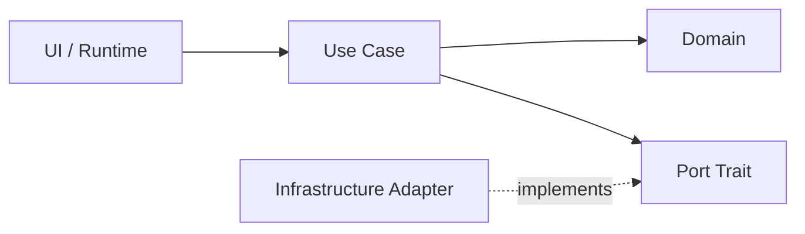
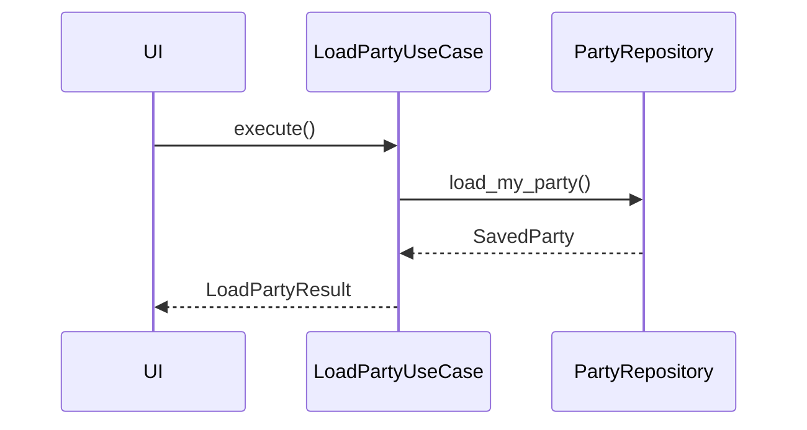
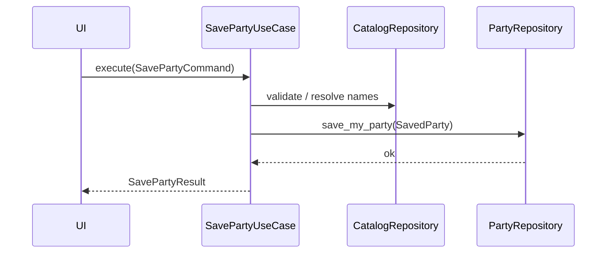
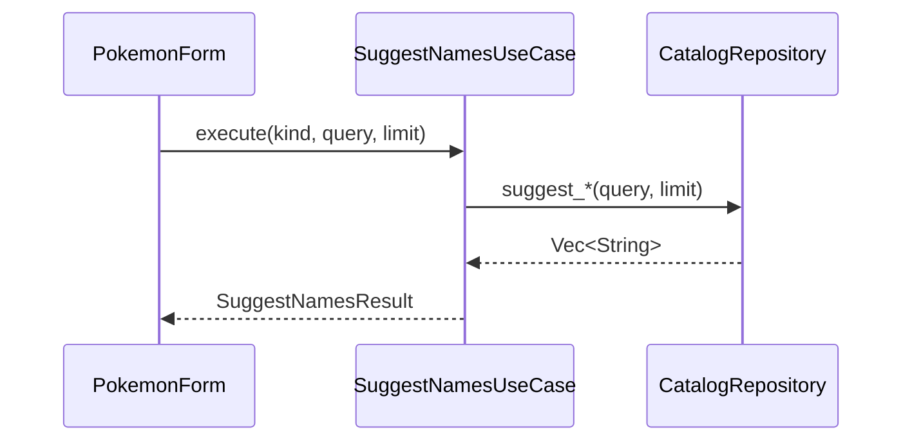
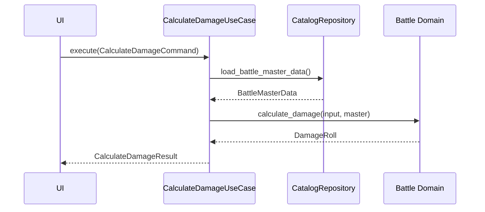
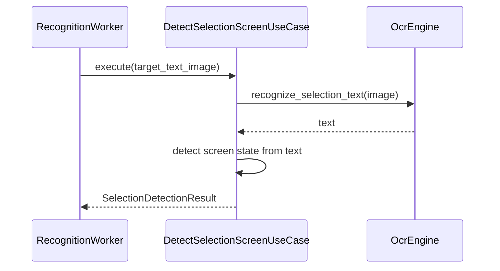
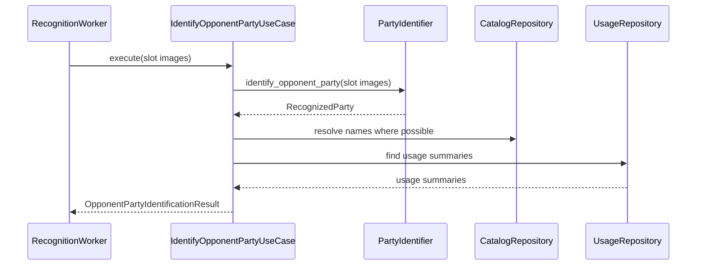
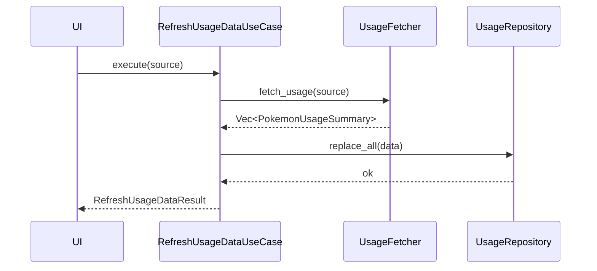

# 07. Use Case と Port 設計

## この文書の範囲

この文書は、`champions-application` の use case、port trait、application input/output 型を定義する。worker の頻度制御は `06_runtime_and_iced_preview.md`、型の所属と変換は `08_data_boundaries.md` を正とする。

## Application layer の役割

`champions-application` は、UI または runtime から要求されるアプリ操作を use case として提供する。外部技術には直接依存せず、port trait を通じて infrastructure を利用する。



## Use Case 一覧

| Use Case | 呼び出し元 | 入力 | 出力 | 主な port | domain 利用 |
|---|---|---|---|---|---|
| `LoadPartyUseCase` | UI | なし | `LoadPartyResult` | `PartyRepository` | `SavedParty` |
| `SavePartyUseCase` | UI | `SavePartyCommand` | `SavePartyResult` | `PartyRepository`, `CatalogRepository` | party validation |
| `SuggestNamesUseCase` | UI | `SuggestNamesQuery` | `SuggestNamesResult` | `CatalogRepository` | catalog model |
| `CalculateDamageUseCase` | UI | `CalculateDamageCommand` | `CalculateDamageResult` | `CatalogRepository` | battle formula |
| `DetectSelectionScreenUseCase` | runtime | `DetectSelectionScreenCommand` | `SelectionDetectionResult` | `OcrEngine` | `ScreenState` |
| `IdentifyOpponentPartyUseCase` | runtime | `IdentifyOpponentPartyCommand` | `OpponentPartyIdentificationResult` | `PartyIdentifier`, `UsageRepository`, `CatalogRepository` | recognition / usage |
| `RefreshUsageDataUseCase` | UI | `RefreshUsageDataCommand` | `RefreshUsageDataResult` | `UsageFetcher`, `UsageRepository` | usage model |
| `GetPokemonUsageUseCase` | UI | `GetPokemonUsageQuery` | `GetPokemonUsageResult` | `UsageRepository`, `CatalogRepository` | usage model |

Use case は UI-facing view model を返さない。UI 表示への変換は `apps/desktop/src/mapping.rs` または runtime event mapper で行う。

## Image boundary

OCR / ONNX port に渡す画像は OpenCV `Mat` ではなく owned image buffer とする。

```rust
pub struct ImageBuffer {
    pub width: u32,
    pub height: u32,
    pub pixel_format: PixelFormat,
    pub bytes: Arc<[u8]>,
}

pub enum PixelFormat {
    Bgr8,
    Rgb8,
    Rgba8,
    Gray8,
}
```

`ImageBuffer` は `champions-application/src/image.rs` に置く。application は OpenCV を知らない。

## Port 一覧

### CatalogRepository

```rust
pub trait CatalogRepository: Send + Sync {
    fn suggest_species(&self, query: &str, limit: usize) -> Result<Vec<String>, CatalogError>;
    fn suggest_moves(&self, query: &str, limit: usize) -> Result<Vec<String>, CatalogError>;
    fn suggest_items(&self, query: &str, limit: usize) -> Result<Vec<String>, CatalogError>;
    fn suggest_natures(&self, query: &str, limit: usize) -> Result<Vec<String>, CatalogError>;
    fn suggest_abilities(&self, query: &str, limit: usize) -> Result<Vec<String>, CatalogError>;
    fn resolve_species_name(&self, name: &str) -> Result<Option<SpeciesId>, CatalogError>;
    fn load_battle_master_data(&self) -> Result<BattleMasterData, CatalogError>;
}
```

### PartyRepository

```rust
pub trait PartyRepository: Send + Sync {
    fn load_my_party(&self) -> Result<SavedParty, PartyRepositoryError>;
    fn save_my_party(&self, party: &SavedParty) -> Result<(), PartyRepositoryError>;
}
```

現行の `find_best_match(image_data)` は repository ではないため、この trait には入れない。

### UsageRepository

```rust
pub trait UsageRepository: Send + Sync {
    fn find_by_species_id(&self, species_id: SpeciesId) -> Result<Option<PokemonUsageSummary>, UsageError>;
    fn find_by_pokemon_name(&self, name: &str) -> Result<Option<PokemonUsageSummary>, UsageError>;
    fn find_many_by_names(&self, names: &[String]) -> Result<Vec<PokemonUsageSummary>, UsageError>;
    fn replace_all(&self, data: Vec<PokemonUsageSummary>) -> Result<(), UsageError>;
}
```

初期移行では name lookup を維持してよい。`SpeciesId` lookup は段階導入する。

### OcrEngine

```rust
pub trait OcrEngine: Send + Sync {
    fn recognize_selection_text(&self, image: &ImageBuffer) -> Result<String, OcrError>;
}
```

OCR は blocking 処理として扱う。runtime worker 側で UI thread から分離して呼ぶ。

### PartyIdentifier

```rust
pub trait PartyIdentifier: Send + Sync {
    fn identify_opponent_party(&self, input: &PartyImageSet) -> Result<RecognizedParty, PartyIdentifierError>;
}
```

`PartyImageSet` は slot ごとの cropped icon image を持つ。

```rust
pub struct PartyImageSet {
    pub slots: Vec<SelectionSlotImage>,
}

pub struct SelectionSlotImage {
    pub slot: SelectionSlot,
    pub image: ImageBuffer,
}
```

DINOv2 / ONNX / embedding cache は infrastructure 実装に閉じ込める。

### UsageFetcher

```rust
pub trait UsageFetcher: Send + Sync {
    fn fetch_usage(&self, source: UsageSource) -> Result<Vec<PokemonUsageSummary>, UsageFetchError>;
}
```

初期実装では `reqwest::blocking` の継続でよい。将来 async HTTP 化が必要になった場合だけ別 trait に分ける。

## Use Case 詳細

### LoadPartyUseCase



```rust
pub struct LoadPartyResult {
    pub party: SavedParty,
}
```

### SavePartyUseCase



```rust
pub struct SavePartyCommand {
    pub party: SavedParty,
}

pub struct SavePartyResult {
    pub saved_count: usize,
    pub warnings: Vec<PartyValidationWarning>,
}
```

UI は `std::fs::write` を呼ばない。

### SuggestNamesUseCase



```rust
pub enum SuggestKind {
    Species,
    Move,
    Item,
    Nature,
    Ability,
}

pub struct SuggestNamesQuery {
    pub kind: SuggestKind,
    pub query: String,
    pub limit: usize,
}

pub struct SuggestNamesResult {
    pub suggestions: Vec<String>,
}
```

### CalculateDamageUseCase



```rust
pub struct CalculateDamageCommand {
    pub input: DamageInput,
}

pub struct CalculateDamageResult {
    pub roll: DamageRoll,
}
```

計算本体は domain に置く。CSV load は repository に置く。

### DetectSelectionScreenUseCase



```rust
pub struct DetectSelectionScreenCommand {
    pub target_text_image: ImageBuffer,
}

pub struct SelectionDetectionResult {
    pub raw_text: String,
    pub screen_state: ScreenState,
    pub matched_keywords: Vec<String>,
}
```

この use case は DINOv2 を呼ばない。

### IdentifyOpponentPartyUseCase



```rust
pub struct IdentifyOpponentPartyCommand {
    pub party_images: PartyImageSet,
    pub config: RecognitionConfig,
}

pub struct RecognitionConfig {
    pub top_candidates: usize,
}

pub struct OpponentPartyIdentificationResult {
    pub recognized_party: RecognizedParty,
    pub usage_summaries: Vec<PokemonUsageSummary>,
    pub conflicts: Vec<RecognitionConflict>,
}
```

この use case は scheduler を持たない。呼び出し頻度は runtime が制御する。

### RefreshUsageDataUseCase



```rust
pub struct RefreshUsageDataCommand {
    pub source: UsageSource,
}

pub struct RefreshUsageDataResult {
    pub count: usize,
}
```

### GetPokemonUsageUseCase

```rust
pub struct GetPokemonUsageQuery {
    pub name: String,
}

pub struct GetPokemonUsageResult {
    pub usage: Option<PokemonUsageSummary>,
}
```

## Application error 方針

| Error | 例 | UI 表示 |
|---|---|---|
| `CatalogError` | CSV missing、invalid row、name resolve failure | 起動時またはフォームで error banner |
| `PartyRepositoryError` | `party.json` read / write failure | 保存失敗 dialog |
| `UsageError` | `usage.json` parse failure | 選出サポートに警告 |
| `OcrError` | OCR model missing、推論失敗 | 認識状態に警告。アプリは落とさない |
| `PartyIdentifierError` | ONNX model missing、CUDA failure | 認識停止 + error 表示 |
| `UsageFetchError` | GameWith parse failure | refresh 結果として表示 |

## Use Case でやらないこと

```text
Iced widget を作る
RuntimeEvent を直接組み立てる
OpenCV VideoCapture を開く
highgui::imshow を呼ぶ
worker thread を spawn する
frame queue を管理する
tokio runtime を生成する
file path を直書きする
```
