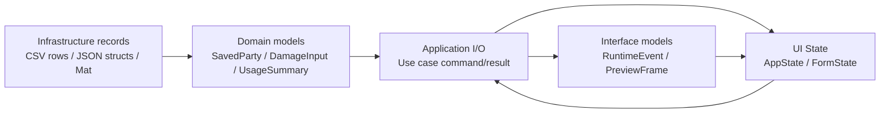
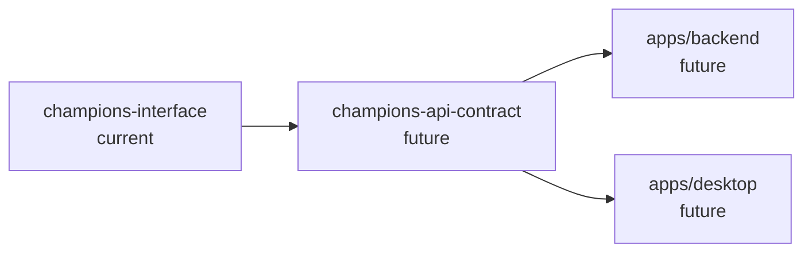

# 08. データ境界と型設計

## この文書の範囲

この文書は、domain、application、interface、UI、infrastructure の間でどの型を使うか、どこで変換するかを定義する。use case の処理順は `07_use_cases_and_ports.md`、worker の実行設計は `06_runtime_and_iced_preview.md` を正とする。

## 型レイヤーの全体像



型変換は必要な境界だけで行う。全境界で機械的に DTO を作らない。

## 境界ごとの型の役割

| 層 | 型の例 | 役割 | 禁止事項 |
|---|---|---|---|
| Infrastructure | CSV record、JSON record、OpenCV `Mat`、ONNX tensor | 外部技術や保存形式に合わせる | UI state として使わない |
| Domain | `SavedParty`, `PokemonBuild`, `DamageInput`, `PokemonUsageSummary` | ルールと意味を持つ | file path、OpenCV、Iced を含めない |
| Application | `SavePartyCommand`, `SelectionDetectionResult`, `ImageBuffer` | 操作単位の入力と出力 | interface 型、Iced widget を含めない |
| Interface | `RuntimeCommand`, `RuntimeEvent`, `PreviewFrame` | UI と runtime の共有境界 | `Mat`、repository、application result を含めない |
| UI State | `AppState`, `PreviewState`, `PokemonFormState` | 表示と入力途中状態 | repository、OCR、ONNX、MasterData を持たない |

## Infrastructure records

| 型 | 置き場所 | 由来 |
|---|---|---|
| `PokemonStatRecord` | `csv_catalog_repository.rs` | `pokemon_stats.csv` |
| `MoveRecord` | `csv_catalog_repository.rs` | `moves.csv` |
| `NatureRecord` | `csv_catalog_repository.rs` | `natures.csv` |
| `TypeEfficacyRecord` | `csv_catalog_repository.rs` | `type_efficacy.csv` |
| `UsageJsonRecord` | `json_usage_repository.rs` | `usage.json` |
| `SavedPartyJsonRecord` | `json_party_repository.rs` | `party.json` |
| `Mat` | `opencv_capture.rs` / `cropper.rs` 内部 | OpenCV |
| ONNX tensor | `onnx_party_identifier.rs` 内部 | ONNX Runtime |

CSV / JSON record は domain に置かない。domain は保存形式ではなく意味のある型を持つ。

## Domain model

### Catalog

```rust
pub struct SpeciesId(pub u32);

pub struct PokemonSpecies {
    pub id: SpeciesId,
    pub display_name: String,
    pub aliases: Vec<String>,
}
```

初期保存形式は文字列互換を維持してよい。ただし内部照合は徐々に `SpeciesId` に寄せる。

### Party

```rust
pub struct SavedParty {
    pub pokemons: Vec<PokemonBuild>,
}

pub struct PokemonBuild {
    pub species_name: String,
    pub item_name: Option<String>,
    pub ability_name: Option<String>,
    pub nature_name: Option<String>,
    pub effort_values: EffortValueSpread,
    pub moves: MoveSet,
}
```

UI 入力途中 state ではなく、保存・計算対象として意味を持つ party model である。

### Battle

```rust
pub struct DamageInput {
    pub attacker_id: u32,
    pub defender_id: u32,
    pub move_id: u32,
    pub attacker_ap: [u32; 6],
    pub defender_ap: [u32; 6],
    pub attacker_nature_id: u32,
    pub defender_nature_id: u32,
    pub attacker_stages: [i8; 8],
    pub defender_stages: [i8; 8],
    pub attacker_status_id: Option<u32>,
    pub is_critical: bool,
    pub rng_roll: f64,
}

pub struct DamageRoll {
    pub damage: u32,
}
```

現行 `DamageArgs` は `DamageInput` に寄せる。

### Recognition

```rust
pub struct RecognizedPokemon {
    pub slot: SelectionSlot,
    pub species_id: Option<SpeciesId>,
    pub display_name: Option<String>,
    pub confidence: ConfidenceScore,
    pub candidates: Vec<RecognitionCandidate>,
}

pub struct RecognitionCandidate {
    pub species_id: Option<SpeciesId>,
    pub display_name: String,
    pub score: f32,
}

pub struct RecognizedParty {
    pub pokemons: Vec<RecognizedPokemon>,
}
```

`confidence` が閾値未満の場合は `display_name: None` または unknown として扱う。

### Usage

```rust
pub struct PokemonUsageSummary {
    pub species_id: Option<SpeciesId>,
    pub name: String,
    pub types: Vec<String>,
    pub moves: Vec<MoveUsage>,
    pub items: Vec<ItemUsage>,
    pub effort_values: Vec<EffortValueUsage>,
    pub natures: Vec<NatureUsage>,
}
```

## Application I/O

Application I/O は use case 単位の command / result である。UI 表示都合に寄せない。

| Use case | Input | Output |
|---|---|---|
| Load party | なし | `LoadPartyResult { party: SavedParty }` |
| Save party | `SavePartyCommand { party }` | `SavePartyResult { saved_count, warnings }` |
| Suggest names | `SuggestNamesQuery { kind, query, limit }` | `SuggestNamesResult { suggestions }` |
| Calculate damage | `CalculateDamageCommand { input }` | `CalculateDamageResult { roll }` |
| Detect selection | `DetectSelectionScreenCommand { target_text_image }` | `SelectionDetectionResult` |
| Identify opponent | `IdentifyOpponentPartyCommand { party_images, config }` | `OpponentPartyIdentificationResult` |
| Refresh usage | `RefreshUsageDataCommand { source }` | `RefreshUsageDataResult { count }` |

## Interface model

### IDs

```rust
pub struct FrameSequence(pub u64);
pub struct EventSequence(pub u64);
pub struct RecognitionAttemptId(pub u64);
```

### RuntimeCommand

UI から runtime への命令。application use case command とは別物である。

```rust
pub enum RuntimeCommand {
    StartCapture,
    StopCapture,
    StartRecognition,
    StopRecognition,
    SetPreviewEnabled(bool),
    SetPreviewTargetFps(u8),
    SetPreviewMaxWidth(u32),
    SetCropRegion(ImageRect),
    SamplePixel { frame_sequence: FrameSequence, point: ImagePoint },
    SaveDebugSnapshot { frame_sequence: Option<FrameSequence> },
    Shutdown,
}
```

### RuntimeEvent

runtime から UI への通知。preview は含めない。

```rust
pub enum RuntimeEvent {
    CaptureStatusChanged { event_sequence: EventSequence, status: CaptureStatus },
    RecognitionStatusChanged { event_sequence: EventSequence, status: RecognitionStatus },
    OpponentPartyRecognized {
        event_sequence: EventSequence,
        frame_sequence: FrameSequence,
        attempt_id: RecognitionAttemptId,
        party: OpponentPartyView,
    },
    Error { event_sequence: EventSequence, error: RuntimeError },
    RuntimeStopped { event_sequence: EventSequence },
}
```

### PreviewFrame

```rust
pub struct PreviewFrame {
    pub frame_sequence: FrameSequence,
    pub timestamp_millis: u64,
    pub width: u32,
    pub height: u32,
    pub rgba: Arc<[u8]>,
}
```

### RuntimeError

```rust
pub struct RuntimeError {
    pub source: RuntimeErrorSource,
    pub kind: RuntimeErrorKind,
    pub severity: RuntimeErrorSeverity,
    pub recoverability: Recoverability,
    pub message: String,
    pub suggested_action: Option<String>,
}
```

| Field | 用途 |
|---|---|
| `source` | capture、preview、recognition、repository など発生元 |
| `kind` | camera unavailable、model missing、parse failure など分類 |
| `severity` | info、warning、error、fatal |
| `recoverability` | retryable、requires user action、fatal など |
| `message` | UI 表示用の短い説明 |
| `suggested_action` | model path 確認、camera 接続確認など |

## UI State

### AppState

```rust
pub struct AppState {
    pub active_page: Page,
    pub party_editor: PartyEditorState,
    pub selection_support: SelectionSupportState,
    pub preview: PreviewState,
    pub runtime_status: RuntimeStatusView,
    pub global_error: Option<String>,
}
```

`AppState` は repository、OCR、ONNX、MasterData を持たない。

### PokemonFormState

```rust
pub struct PokemonFormState {
    pub label: String,
    pub species: String,
    pub item: String,
    pub ability: String,
    pub nature: String,
    pub moves: [String; 4],
    pub effort_values: EffortValueInputState,
    pub active_field: Option<PokemonFormField>,
    pub suggestions: Vec<String>,
    pub validation_errors: Vec<FormValidationError>,
    pub dirty: bool,
}
```

入力途中の文字列、focus、候補、error を持つ UI state である。domain の `PokemonBuild` ではない。

### PreviewState

```rust
pub struct PreviewState {
    pub latest_frame_sequence: Option<FrameSequence>,
    pub image_handle: Option<iced::widget::image::Handle>,
    pub status: PreviewStatus,
    pub fps: Option<f32>,
    pub drop_count: u64,
    pub error: Option<String>,
}
```

`PreviewState` は最新 image handle だけを保持する。RGBA 履歴は持たない。

## 型変換ルール

| From | To | 変換場所 | 理由 |
|---|---|---|---|
| CSV record | Domain master data | `CsvCatalogRepository` | 保存形式を domain へ漏らさない |
| JSON party record | `SavedParty` | `JsonPartyRepository` | JSON schema を domain へ漏らさない |
| GameWith raw data | `PokemonUsageSummary` | `GameWithUsageClient` | 外部サイト形式を閉じる |
| OpenCV `Mat` | `ImageBuffer` | `OpenCvCapture` / `OpenCvCropper` | OpenCV を外へ出さない |
| `PokemonFormState` | `SavePartyCommand` | `apps/desktop/src/mapping.rs` | 入力途中 state から保存対象へ変換 |
| Application result | UI state | `apps/desktop/src/app.rs` / `mapping.rs` | use case result を表示に反映 |
| `OpponentPartyIdentificationResult` | `OpponentPartyView` | `champions-runtime` mapper | runtime event payload に変換 |
| `PreviewFrame` | `image::Handle` | `PreviewState` update | Iced 依存を interface に入れない |
| `ImagePoint` | pixel coordinate | runtime adapter / cropper | UI に OpenCV を入れない |

## Path model

`AppPaths` は infrastructure に置く。UI は path を組み立てない。

```rust
pub struct AppPaths {
    pub bundled_resources_dir: PathBuf,
    pub master_data_dir: PathBuf,
    pub model_dir: PathBuf,
    pub pokemon_images_dir: PathBuf,
    pub user_data_dir: PathBuf,
    pub cache_dir: PathBuf,
    pub debug_dir: PathBuf,
}
```

| Path | 用途 | writable |
|---|---|---:|
| `master_data_dir` | CSV master data | no |
| `model_dir` | ONNX / OCR model | no |
| `pokemon_images_dir` | recognition master images | no |
| `user_data_dir/party.json` | 自分の party | yes |
| `cache_dir/usage.json` | usage cache | yes |
| `debug_dir/captures` | debug snapshot | yes |

## Atomic write

`party.json` と `usage.json` は atomic write する。

```text
1. target.tmp に JSON を書く
2. flush する
3. 可能なら既存 target を target.bak に退避
4. rename target.tmp -> target
5. failure 時は tmp を削除し、旧 target を維持する
```

## 禁止される型漏れ

| 型 | 漏らしてはいけない先 | 代替 |
|---|---|---|
| `opencv::core::Mat` | runtime、application、interface、UI、domain | `ImageBuffer`, `PreviewFrame`, `ImagePoint`, `ImageRect` |
| `serde_json::Value` | domain、UI | infrastructure record / parser |
| `iced::Element` | domain、application、infrastructure、interface | UI component 内に限定 |
| ONNX tensor | domain、application、interface、UI | `RecognizedParty` |
| CSV record | domain、UI | `BattleMasterData`, catalog model |
| `std::path::PathBuf` | domain、UI state | `AppPaths` in infrastructure |

## 将来 IPC 化する場合

将来、別 process backend を追加する場合は、`champions-interface` から serialize 可能な型を選び、`champions-api-contract` を分離する。その時点まで request / response DTO は作らない。


