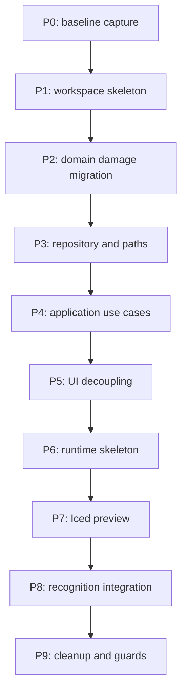

# 09. 移行計画

## この文書の範囲

この文書は、現行ファイルから v3 構造へ段階的に移行する順序、各 phase の完了条件、移動表、rollback 方針を定義する。テストと性能運用の詳細は `10_testing_performance_operations.md` を正とする。

## 移行原則

| 原則 | 内容 |
|---|---|
| 小さく分ける | workspace 分割、runtime 導入、HighGUI 廃止を一度に行わない |
| 常に buildable | 各 phase 終了時点で `cargo check` が通る状態にする |
| 既存機能を守る | damage test、party save/load、recognition の順に安全網を作る |
| 重い変更は後半 | OpenCV / ONNX / OCR runtime 統合は repository / use case 移行後に行う |
| 仮実装を残さない | 移行後に古い module と仮実装を削除する |

## Phase 概要



## P0. Baseline capture

### 作業

| 作業 | 内容 |
|---|---|
| 現行 branch 固定 | 移行前の動作 commit を作る |
| 現行 test 実行 | `cargo test` の通過 / 失敗を記録する |
| 現行起動確認 | party editor、save、camera、recognition の現状を記録する |
| 現行資産確認 | `master_data`, `models`, `assets/fonts`, `scripts` の存在を確認する |

### 完了条件

```text
baseline commit がある
現行 cargo test 結果が記録されている
現行起動時の既知問題が docs または issue に記録されている
```

## P1. Workspace skeleton

### 作業

| 作業 | 内容 |
|---|---|
| root `Cargo.toml` を workspace 化 | `apps/desktop` と `crates/*` を members にする |
| crate skeleton 作成 | domain、application、infrastructure、runtime、interface を作る |
| `apps/desktop` 作成 | 現行 binary を一旦移す |
| `mod.rs` 不使用化 | `foo.rs` + `foo/bar.rs` の形に揃える |

### 完了条件

```text
cargo check --workspace が通る
apps/desktop が現行 UI 相当で起動する
新 crate は空でも build 可能
```

## P2. Domain damage migration

### 移行対象

| 現行 | 移行先 |
|---|---|
| `src/damage/calc.rs` | `crates/champions-domain/src/battle/damage_formula.rs` |
| `src/damage/models.rs` の `DamageArgs` | `crates/champions-domain/src/battle/damage_input.rs` |
| `src/damage/models.rs` の `MasterData` | `crates/champions-domain/src/catalog/battle_master_data.rs` |
| `src/damage.rs` の rstest | `crates/champions-domain/src/battle/*` tests または integration test |

### 作業

| 作業 | 内容 |
|---|---|
| 型名整理 | `DamageArgs` を `DamageInput` に寄せる |
| 計算本体移植 | file I/O を含めず純粋計算だけ移す |
| regression test 移植 | 既存 expected 値を維持する |
| old module 参照置換 | desktop 側は一旦 domain API を呼ぶ |

### 完了条件

```text
champions-domain が opencv / iced / csv に依存しない
ダメージ計算 regression test が通る
```

## P3. Repository と AppPaths

### 移行対象

| 現行 | 移行先 |
|---|---|
| `src/damage/loader.rs` | `CsvCatalogRepository` |
| `src/domain/master_data.rs` | `CsvCatalogRepository` + `SuggestNamesUseCase` |
| `src/ui/app.rs` の `party.json` read/write | `JsonPartyRepository` |
| `src/lib.rs` の usage JSON 型の一部 | domain usage model + `JsonUsageRepository` |
| `main.rs` の path 定数 | `AppPaths` |

### 作業

| 作業 | 内容 |
|---|---|
| `AppPaths` 作成 | resources/user_data/cache/debug を解決する |
| `PartyRepository` 実装 | load/save と atomic write を実装する |
| `UsageRepository` 実装 | usage cache の load/replace を実装する |
| `CatalogRepository` 実装 | CSV load と suggest を実装する |
| resource 移動 | `master_data/pokemon_images` を `resources/pokemon_images` へ寄せる |

### 完了条件

```text
party.json は user_data に保存される
usage.json は cache に保存される
resources へ書き込まない
repository unit test が通る
```

## P4. Application use cases

### 作業

| Use Case | 接続対象 |
|---|---|
| `LoadPartyUseCase` | `PartyRepository` |
| `SavePartyUseCase` | `PartyRepository`, `CatalogRepository` |
| `SuggestNamesUseCase` | `CatalogRepository` |
| `CalculateDamageUseCase` | `CatalogRepository`, domain battle |
| `RefreshUsageDataUseCase` | `UsageFetcher`, `UsageRepository` |
| `GetPokemonUsageUseCase` | `UsageRepository` |

### 完了条件

```text
champions-application が champions-interface に依存しない
use case test は fake repository で実行できる
UI を起動しなくても party save/load と suggest を test できる
```

## P5. UI decoupling

### 移行対象

| 現行 UI の責務 | 移行先 |
|---|---|
| `PokeEditorApp` の `std::fs::read_to_string` | `LoadPartyUseCase` |
| `PokeEditorApp` の `std::fs::write` | `SavePartyUseCase` |
| `PokemonState.master_data` | 削除。suggest result だけ持つ |
| `PokemonState::update_suggestions` | `SuggestNamesUseCase` 呼び出し |
| UI 内 `PokemonUsage` DTO | domain usage / interface recognition view に分離 |

### 作業

| 作業 | 内容 |
|---|---|
| UI state 整理 | `AppState`, `PartyEditorState`, `PokemonFormState` を作る |
| mapping 作成 | form state <-> application command/result を変換する |
| save/load task 化 | Iced `Task` で use case を呼ぶ |
| suggestion task 化 | 入力変更時に use case を呼ぶ |

### 完了条件

```text
apps/desktop/src/app.rs, state, pages, components から std::fs と champions_infrastructure import が消える
UI state に MasterData がない
party editor が保存 / 読み込みできる
```

## P6. Runtime skeleton

### 作業

| 作業 | 内容 |
|---|---|
| `RuntimeHandle` 作成 | command send API を作る |
| `RuntimeBuilder` 作成 | dependencies を受け取り worker を組む |
| stream 分離 | preview stream と runtime event stream を分ける |
| latest slot 作成 | `CapturedFrame` latest slot を作る |
| fake adapter 作成 | test 用 `FakeFrameSource` を用意する |

### 完了条件

```text
champions-runtime が champions-infrastructure に依存しない
fake frame source で capture / preview / shutdown test が書ける
RuntimeCommand::Shutdown で RuntimeStopped が届く
```

## P7. Iced preview

### 移行対象

| 現行 | 移行先 |
|---|---|
| `main.rs` capture thread | `CaptureWorker` + `FrameSource` adapter |
| `highgui::imshow` | `VideoPreview` component |
| `CAP_V4L2` 固定 | `CaptureConfig.backend` |
| `process::exit(0)` | `RuntimeCommand::Shutdown` |

### 作業

| 作業 | 内容 |
|---|---|
| OpenCV capture adapter | `Mat` を owned `ImageBuffer` に変換する |
| Preview converter | captured frame を RGBA8 preview に変換する |
| Iced subscription | preview stream を購読する |
| VideoPreview component | latest image handle だけ表示する |

### 完了条件

```text
通常起動で HighGUI window が出ない
Iced 画面内に preview が表示される
preview が詰まっても runtime event が遅延しない
```

## P8. Recognition integration

### 移行対象

| 現行 | 移行先 |
|---|---|
| `src/party/cutout.rs` | `OpenCvCropper` / `RecognitionImageExtractor` adapter |
| `src/party/ocr.rs` | `MangaOcrEngine` |
| `src/party/identifier.rs` | `OnnxPartyIdentifier` |
| `main.rs` の history | `RecognitionScheduler` |
| `main.rs` の usage_map lookup | `IdentifyOpponentPartyUseCase` |

### 作業

| 作業 | 内容 |
|---|---|
| OCR use case 接続 | target_text crop -> `DetectSelectionScreenUseCase` |
| ONNX use case 接続 | slot crops -> `IdentifyOpponentPartyUseCase` |
| confidence policy | threshold / candidates / unknown を実装する |
| duplicate conflict | 同一 party 内重複を警告として返す |
| UI event mapping | `OpponentPartyIdentificationResult` -> `OpponentPartyView` |

### 完了条件

```text
選出画面に入った時だけ DINOv2 が走る
usage が見つからないポケモンも recognized slot として表示される
top candidates を debug log または debug output で確認できる
```

## P9. Cleanup and guards

### 作業

| 作業 | 内容 |
|---|---|
| 旧 module 削除 | `src/*` の旧構造を削除または移行済みにする |
| 仮実装削除 | `OnnxPartyIdentifier` 仮実装、`PartyOrchestrator` の不使用箇所を削除する |
| CI guard 追加 | UI import guard、forbidden dependency check を入れる |
| docs 更新 | README と docs を v3 構造に合わせる |
| debug-highgui off | 通常 build から highgui を外す |

### 完了条件

```text
cargo check --workspace
cargo test --workspace
UI import guard pass
forbidden dependency check pass
HighGUI 通常 path なし
```

## 現行ファイル移動表

| 現行ファイル | 主な移行先 | 備考 |
|---|---|---|
| `src/main.rs` | `apps/desktop/src/main.rs`, `composition.rs`, `champions-runtime` | 処理本体を分解する |
| `src/lib.rs` | `GameWithUsageClient`, domain usage model | lib root の fetcher は解体する |
| `src/ui/app.rs` | `apps/desktop/src/app.rs`, `pages/*`, `state/*`, `components/usage_table.rs` | DTO と保存処理を除去する |
| `src/ui/pokemon.rs` | `components/pokemon_form.rs`, `state/pokemon_form_state.rs` | MasterData を除去する |
| `src/domain/master_data.rs` | `CsvCatalogRepository` | domain から file I/O を除去する |
| `src/domain/party.rs` | `champions-domain/src/party/*` | `PartyRepository` 名の識別 trait は廃止 |
| `src/domain/damage.rs` | `champions-domain/src/battle/*` | 型名を整理する |
| `src/domain/services.rs` | 原則削除 | port は application に置く |
| `src/damage/calc.rs` | `champions-domain/src/battle/damage_formula.rs` | 計算本体 |
| `src/damage/loader.rs` | `CsvCatalogRepository` | CSV load |
| `src/damage/models.rs` | domain battle/catalog + infrastructure CSV records | 保存形式と domain を分離 |
| `src/party/cutout.rs` | `champions-infrastructure/src/vision/cropper.rs` | crop 比率を維持 |
| `src/party/ocr.rs` | `MangaOcrEngine` | port 実装 |
| `src/party/identifier.rs` | `OnnxPartyIdentifier` | 本実装の移植元 |
| `src/application/party_service.rs` | use case test 参考。原則置換 | 本 pipeline ではない |
| `src/infrastructure/party_identifier_impl.rs` | 削除 | 仮実装 |
| `scripts/download_pokemon_images.py` | `tools/download_pokemon_images.py` | path を `resources` 基準へ修正 |
| `scripts/export_dino.py` | `tools/export_dino.py` | output を `resources/models` へ修正 |

## Rollback 方針

| Phase | rollback 単位 |
|---|---|
| P1 | workspace skeleton commit ごと revert |
| P2 | domain damage crate だけ revert 可能にする |
| P3 | repository を feature / adapter で切り替え可能にする |
| P4-P5 | UI save/load の use case 接続を旧 path に戻せる commit 境界を作る |
| P6-P8 | runtime 導入は branch 境界を分ける。HighGUI 廃止前に Iced preview を検証する |

## 移行完了定義

```text
すべての crate が workspace で build される
通常起動で HighGUI window が出ない
party save/load は user_data 経由
usage refresh は cache 経由
domain は外部技術に依存しない
runtime は infrastructure に依存しない
UI module import guard が通る
recognition は scheduler により throttled
shutdown は RuntimeStopped で完了する
```
