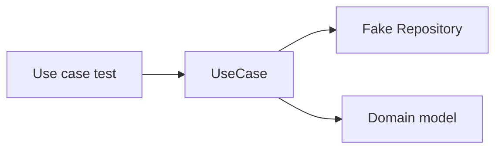
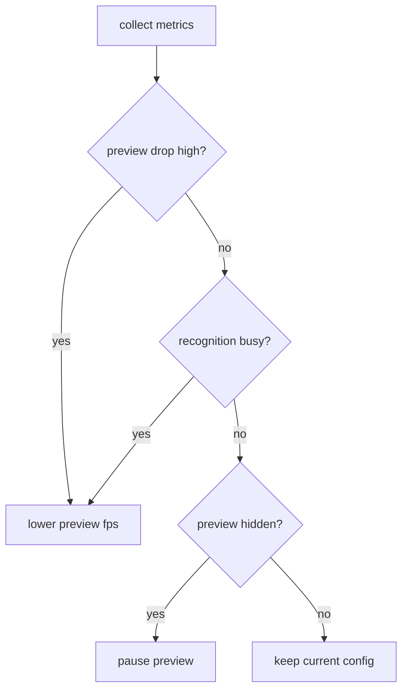

# 10. テスト・性能・運用設計

## この文書の範囲

この文書は、テスト戦略、CI guard、性能計測、logging、debug、運用時の error handling を定義する。移行順序は `09_migration_plan.md` を正とする。

## テスト方針

| レイヤー | テスト対象 | 技術依存 | 目的 |
|---|---|---|---|
| Domain unit test | damage formula、stat、type effectiveness、recognition policy | なし | ルールの回帰防止 |
| Application unit test | use case、validation、error mapping | fake port | UI / infra なしで business flow を検証 |
| Infrastructure unit test | CSV / JSON parser、atomic write、path resolution | file fixture | 保存形式と parser の検証 |
| Runtime unit test | scheduler、latest slot、shutdown、stream drop policy | fake adapter | OpenCV / ONNX なしで実行制御を検証 |
| Desktop UI smoke test | app 起動、message update、mapping | Iced | UI state の回帰防止 |
| Integration test | repository + use case、runtime fake end-to-end | fixture | cross-crate 接続確認 |

## Domain test

既存 damage regression test は最初に移植する。

| Test | 内容 |
|---|---|
| `test_damage_variations` | 無効、威力 0、乱数、急所 |
| `test_rank_stages` | ランク補正と急所の相互作用 |
| `test_error_cases` | attacker / defender / move 不存在 |
| `test_master_data_integrity` | CSV fixture の整合性 |

Domain test では file I/O を直接しない。必要な master data は test fixture から infrastructure repository で作るか、domain model を手組みする。

## Application test

Use case は fake port でテストする。



| Use case | 必須 test |
|---|---|
| `LoadPartyUseCase` | party が空 / 6 匹 / repository error |
| `SavePartyUseCase` | validation warning、repository error、保存件数 |
| `SuggestNamesUseCase` | query 空、prefix match、limit |
| `CalculateDamageUseCase` | master load error、calculation success |
| `DetectSelectionScreenUseCase` | OCR hit、OCR miss、OCR error |
| `IdentifyOpponentPartyUseCase` | confidence threshold、unknown、duplicate conflict、usage missing |
| `RefreshUsageDataUseCase` | fetch success、parse error、replace failure |

## Infrastructure test

| Module | Test |
|---|---|
| `CsvCatalogRepository` | CSV fixture 読み込み、suggest、species resolve |
| `JsonPartyRepository` | load existing、load missing、atomic save、broken JSON recovery |
| `JsonUsageRepository` | find by name、replace all、broken cache handling |
| `atomic_write` | temp write、rename、backup、failure cleanup |
| `AppPaths` | development path、override path、missing dir create |
| `GameWithUsageClient` | HTML fixture から parse。network を unit test で叩かない |
| `OpenCvCropper` | fixed image fixture で crop dimension と bounds を確認 |

Network access を伴う test は通常 CI で実行しない。HTML fixture を使う。

## Runtime test

Runtime は infrastructure に依存しないため、fake adapter でテストできる。

| Test | 内容 |
|---|---|
| latest slot replace | 古い frame を蓄積しない |
| preview drop policy | channel full で古い preview を捨てる |
| runtime event no drop | error / stopped が届く |
| scheduler transition | Idle -> Maybe -> Entered -> Stable -> Exited |
| shutdown | command 後に worker が join し `RuntimeStopped` を出す |
| fake recognition | selection screen hit で identify use case が 1 回だけ呼ばれる |

## Desktop UI test

Iced UI は widget snapshot よりも state transition を中心に検証する。

| Test | 内容 |
|---|---|
| `Message::PreviewFrameReceived` | `PreviewState.latest_frame_sequence` が更新される |
| `Message::RuntimeEventReceived(Error)` | status bar / global error が更新される |
| party form update | 入力文字列と dirty flag が更新される |
| save success | dirty flag が false になる |
| suggestion result | active field の suggestion だけ更新される |

## CI guard

### 基本 command

```bash
cargo fmt --check
cargo clippy --workspace --all-targets -- -D warnings
cargo test --workspace
```

### 禁止 dependency guard

```bash
cargo tree -p champions-domain | grep -E "opencv|iced|ort|manga-ocr|reqwest|csv" && exit 1 || true
cargo tree -p champions-application | grep -E "champions-interface|opencv|iced|ort|manga-ocr|reqwest" && exit 1 || true
cargo tree -p champions-runtime | grep -E "champions-infrastructure|opencv|iced|ort|manga-ocr" && exit 1 || true
```

### UI import guard

```bash
if grep -R "champions_infrastructure" \
  apps/desktop/src/app.rs \
  apps/desktop/src/message.rs \
  apps/desktop/src/mapping.rs \
  apps/desktop/src/subscriptions.rs \
  apps/desktop/src/state \
  apps/desktop/src/pages \
  apps/desktop/src/components; then
  echo "UI modules must not import champions_infrastructure" >&2
  exit 1
fi
```

### `Mat` leak guard

```bash
if grep -R "opencv::core::Mat\|core::Mat\|prelude::.*Mat" \
  crates/champions-domain \
  crates/champions-application \
  crates/champions-interface \
  crates/champions-runtime \
  apps/desktop/src; then
  echo "OpenCV Mat leaked outside infrastructure" >&2
  exit 1
fi
```

## 性能計測指標

| Metric | 目標初期値 | 計測場所 |
|---|---:|---|
| capture fps | 30fps 近辺 | `CaptureWorker` |
| preview fps | 10-15fps | `PreviewWorker` / UI |
| preview conversion time | 16ms 以下目安 | `PreviewFrameConverter` |
| UI preview apply time | 16ms 以下目安 | `PreviewState` update 周辺 |
| OCR latency | 実測記録 | `DetectSelectionScreenUseCase` |
| ONNX identification latency | 実測記録 | `IdentifyOpponentPartyUseCase` |
| preview drop count | 継続的に増えない | preview stream |
| runtime event backlog | 0 近辺 | event stream |
| memory usage | frame 蓄積で増加しない | process metrics |

数値は初期目安である。最終的には実機計測で調整する。

## Preview degrade operation



## Logging 方針

`tracing` を使う。`println!` / `eprintln!` は最終実装では避ける。

| Level | 用途 |
|---|---|
| `trace` | frame sequence、scheduler tick など詳細 |
| `debug` | crop size、top candidates、preview drop count |
| `info` | runtime start/stop、model loaded、usage refreshed |
| `warn` | camera retry、usage missing、confidence low |
| `error` | model missing、capture failure、JSON parse failure |

## Debug output

常時書き込みは禁止。UI command または debug setting が有効な時だけ保存する。

```text
debug/
├── captures/
│   └── frame_<frame_sequence>.png
└── recognition/
    └── attempt_<attempt_id>/
        ├── target_text.png
        ├── slot_1.png
        ├── slot_2.png
        ├── ...
        └── candidates.json
```

## Error handling operation

| Error kind | Recoverability | UI action |
|---|---|---|
| `CameraUnavailable` | retryable / user action | camera 接続確認 + retry button |
| `CameraDisconnected` | retryable | status warning + auto retry |
| `OcrModelMissing` | requires user action | model path 確認を促す |
| `OcrInferenceFailed` | retryable | recognition warning |
| `OnnxModelMissing` | requires user action | recognition 停止 + path 確認 |
| `OnnxExecutionProviderFailed` | fallback possible | CPU fallback の有無を表示 |
| `UsageDataUnavailable` | degraded | usage なしで認識名だけ表示 |
| `InvalidResourcePath` | requires user action | settings / path 確認 |
| `Internal` | unknown | error dialog + log |

## Config 方針

初期実装では設定ファイルを増やしすぎない。必要な設定は `AppConfig` に集約し、default を持たせる。

```rust
pub struct AppConfig {
    pub paths: AppPaths,
    pub capture: CaptureConfig,
    pub preview: PreviewConfig,
    pub recognition: RecognitionConfig,
}
```

| Config | 初期値 |
|---|---|
| `CaptureConfig.device_index` | `0` |
| `CaptureConfig.backend` | Windows: `Auto`, Linux: `V4l2` または `Auto` |
| `CaptureConfig.width` | `Some(1920)` |
| `CaptureConfig.height` | `Some(1080)` |
| `CaptureConfig.fps` | `Some(30)` |
| `PreviewConfig.max_width` | `960` |
| `PreviewConfig.target_fps` | `15` |
<<<<<<< HEAD
| `RecognitionConfig.min_confidence` | `0.70` から調整 |
=======
>>>>>>> rearchitect
| `RecognitionConfig.top_candidates` | `3` |

## 完了条件

```text
cargo fmt, clippy, test が通る
禁止 dependency guard が通る
UI import guard が通る
Mat leak guard が通る
repository atomic write test が通る
runtime shutdown test が通る
preview drop policy test が通る
```
